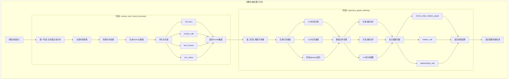
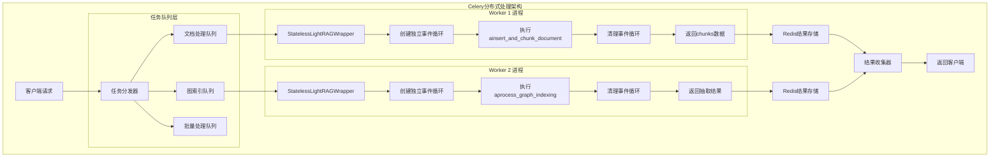
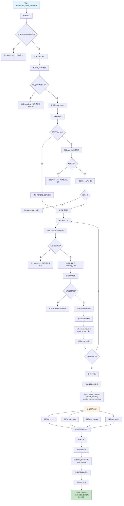
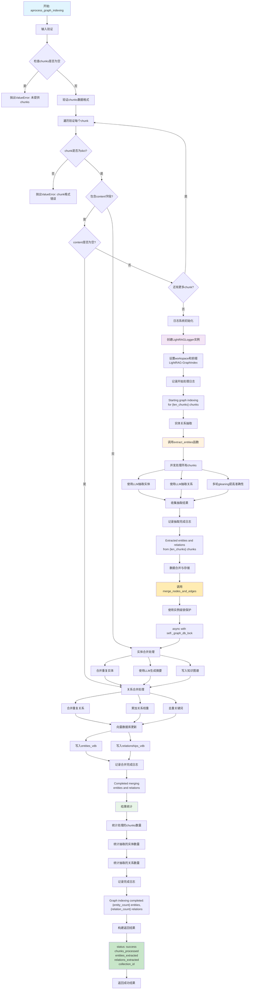

# LightRAG 无状态接口详细文档

## 概述

LightRAG 提供了两个核心的无状态接口，用于将文档处理流程拆分为独立的、可并发执行的步骤：

1. **`ainsert_and_chunk_document`** - 文档插入和分块处理
2. **`aprocess_graph_indexing`** - 图索引构建（实体关系抽取）

这两个接口完全无状态，不依赖全局pipeline状态，可以在Celery等分布式环境中安全并发执行。

## 架构流程图

### 完整处理流程概览



### Celery分布式处理架构



---

## 接口一：ainsert_and_chunk_document

### 功能描述

将文档内容插入系统并执行智能分块处理。这是文档处理流程的第一步，负责：

- 文档内容清理和验证
- 智能文档分块（支持多种分块策略）
- 持久化存储文档和chunks
- 文档状态管理

### 函数签名

```python
async def ainsert_and_chunk_document(
    self,
    documents: list[str],
    doc_ids: list[str] | None = None,
    file_paths: list[str] | None = None,
    split_by_character: str | None = None,
    split_by_character_only: bool = False,
) -> dict[str, Any]
```

### 参数详解

| 参数 | 类型 | 必需 | 描述 |
|------|------|------|------|
| `documents` | `list[str]` | ✅ | 待处理的文档内容列表，每个元素为文档的原始文本 |
| `doc_ids` | `list[str] \| None` | ❌ | 文档ID列表，如果不提供将自动生成MD5哈希ID |
| `file_paths` | `list[str] \| None` | ❌ | 文件路径列表，用于引用和溯源，默认为"unknown_source" |
| `split_by_character` | `str \| None` | ❌ | 指定分块的分隔符（如"\n\n"按段落分块） |
| `split_by_character_only` | `bool` | ❌ | 是否仅按字符分割，不进行token大小检查 |

### 返回值结构

```python
{
    "results": [
        {
            "doc_id": "doc-abcd1234...",           # 文档唯一标识符
            "chunks": ["chunk-xyz789...", ...],     # 生成的chunk ID列表
            "chunk_count": 5,                       # chunks数量
            "chunks_data": {                        # 详细的chunk数据
                "chunk-xyz789...": {
                    "content": "文档内容片段...",
                    "tokens": 512,
                    "chunk_order_index": 0,
                    "full_doc_id": "doc-abcd1234...",
                    "file_path": "example.txt"
                },
                # ... 更多chunks
            },
            "status": "processed"                   # 处理状态
        }
        # ... 更多文档结果
    ],
    "total_documents": 3,                          # 总文档数
    "total_chunks": 15,                            # 总chunk数
    "status": "success"                            # 整体状态
}
```

### 内部处理流程



#### 详细处理步骤说明

1. **输入验证与标准化**
   - 将单个文档转换为列表格式
   - 验证文档ID和文件路径数量匹配
   - 设置默认文件路径

2. **文档ID生成与验证**
   - 如果未提供文档ID，基于内容生成MD5哈希ID
   - 检查文档ID唯一性
   - 验证ID格式有效性

3. **文档处理循环**
   - 清理文档内容（去除无效字符、标准化格式）
   - 执行分块算法（支持多种分块策略）
   - 为每个chunk生成唯一ID
   - 添加元数据（文档ID、文件路径、顺序索引等）

4. **数据持久化**
   - 写入 `full_docs` 存储（完整文档）
   - 写入 `chunks_vdb` 向量数据库（chunk向量索引）
   - 写入 `text_chunks` 键值存储（chunk详细数据）
   - 写入 `doc_status` 状态存储（文档处理状态）

5. **结果汇总**
   - 统计处理结果
   - 返回结构化响应

### 使用示例

#### 基础用法
```python
# 处理单个文档
rag = LightRAG(working_dir="./cache", workspace="collection_123")

result = await rag.ainsert_and_chunk_document(
    documents=["这是一个测试文档的内容..."],
    file_paths=["test_document.txt"]
)

print(f"生成了 {result['total_chunks']} 个chunks")
```

#### 批量处理
```python
# 批量处理多个文档
documents = [
    "第一个文档的内容...",
    "第二个文档的内容...",
    "第三个文档的内容..."
]

doc_ids = ["doc1", "doc2", "doc3"]
file_paths = ["file1.txt", "file2.txt", "file3.txt"]

result = await rag.ainsert_and_chunk_document(
    documents=documents,
    doc_ids=doc_ids,
    file_paths=file_paths
)

# 获取所有chunks数据用于后续处理
all_chunks = {}
for doc_result in result["results"]:
    all_chunks.update(doc_result["chunks_data"])
```

#### 自定义分块策略
```python
# 按段落分块
result = await rag.ainsert_and_chunk_document(
    documents=["段落一\n\n段落二\n\n段落三"],
    split_by_character="\n\n",
    split_by_character_only=True
)

# 混合分块（先按段落，再按token大小）
result = await rag.ainsert_and_chunk_document(
    documents=["长文档内容..."],
    split_by_character="\n\n"  # split_by_character_only=False (默认)
)
```

### 错误处理

常见错误和处理方式：

```python
try:
    result = await rag.ainsert_and_chunk_document(documents=docs)
except ValueError as e:
    if "empty content" in str(e):
        print("文档内容为空")
    elif "Document IDs must be unique" in str(e):
        print("文档ID重复")
    elif "Number of file paths must match" in str(e):
        print("文件路径数量不匹配")
except Exception as e:
    print(f"处理失败: {e}")
```

---

## 接口二：aprocess_graph_indexing

### 功能描述

基于文档chunks执行深度的知识图谱构建。这是文档处理流程的第二步，负责：

- 从文档chunks中抽取实体和关系
- 使用LLM进行智能实体识别和关系提取
- 合并和去重实体关系数据
- 构建知识图谱索引
- 生成向量嵌入用于检索

### 函数签名

```python
async def aprocess_graph_indexing(
    self,
    chunks: dict[str, Any],
    collection_id: str | None = None,
) -> dict[str, Any]
```

### 参数详解

| 参数 | 类型 | 必需 | 描述 |
|------|------|------|------|
| `chunks` | `dict[str, Any]` | ✅ | chunk数据字典，key为chunk_id，value为chunk详细信息 |
| `collection_id` | `str \| None` | ❌ | 集合ID，用于日志记录和性能监控 |

### Chunks数据格式

输入的chunks数据应符合以下格式：

```python
chunks = {
    "chunk-abc123": {
        "content": "实际的文档内容片段...",        # 必需：chunk文本内容
        "tokens": 512,                          # 可选：token数量
        "chunk_order_index": 0,                 # 可选：在原文档中的顺序
        "full_doc_id": "doc-xyz789",           # 可选：原文档ID
        "file_path": "example.txt"              # 可选：文件路径
    },
    # ... 更多chunks
}
```

### 返回值结构

```python
{
    "status": "success",                        # 处理状态：success/error
    "chunks_processed": 10,                     # 处理的chunks数量
    "entities_extracted": 25,                   # 抽取的实体数量
    "relations_extracted": 15,                  # 抽取的关系数量
    "collection_id": "collection_123",          # 集合ID（如果提供）
    
    # 错误情况下的字段
    "error": "错误描述信息"                      # 仅在status为error时存在
}
```

### 内部处理流程



#### 详细处理步骤说明

1. **输入验证**
   - 检查chunks数据格式
   - 验证每个chunk包含必要字段
   - 确保content字段非空

2. **日志系统初始化**
   - 创建专用的LightRAGLogger实例
   - 设置工作空间和前缀标识
   - 开始性能监控

3. **实体关系抽取** (`extract_entities`)
   - 并发处理多个chunks
   - 使用LLM识别实体（人物、地点、组织等）
   - 抽取实体间的关系
   - 支持多轮gleaning提高准确性
   - 生成结构化的实体关系数据

4. **数据合并与存储** (`merge_nodes_and_edges`)
   - 合并重复实体（基于名称和描述）
   - 合并重复关系（基于source和target）
   - 使用LLM生成实体关系摘要（当描述过长时）
   - 写入图数据库（知识图谱结构）
   - 写入向量数据库（支持语义检索）
   - 确保数据一致性（使用实例级锁）

5. **结果统计与返回**
   - 统计处理的chunks数量
   - 统计抽取的实体和关系数量
   - 记录处理时间和性能指标
   - 返回结构化结果

### 使用示例

#### 基础用法
```python
# 从第一步获取chunks数据
doc_result = await rag.ainsert_and_chunk_document(
    documents=["文档内容..."]
)

# 获取chunks进行图索引构建
chunks_data = doc_result["results"][0]["chunks_data"]

# 执行图索引构建
graph_result = await rag.aprocess_graph_indexing(
    chunks=chunks_data,
    collection_id="my_collection"
)

print(f"抽取了 {graph_result['entities_extracted']} 个实体")
print(f"抽取了 {graph_result['relations_extracted']} 个关系")
```

#### 批量处理多个文档的chunks
```python
# 收集多个文档的所有chunks
all_chunks = {}
for doc_result in batch_result["results"]:
    all_chunks.update(doc_result["chunks_data"])

# 一次性处理所有chunks
graph_result = await rag.aprocess_graph_indexing(
    chunks=all_chunks,
    collection_id="batch_collection"
)
```

#### 增量处理
```python
# 只处理新增的chunks
new_chunks = await rag.aget_chunks_by_doc_id("new_doc_id")

graph_result = await rag.aprocess_graph_indexing(
    chunks=new_chunks,
    collection_id="incremental_update"
)
```

### 核心算法详解

#### 实体抽取算法
1. **基于LLM的实体识别**
   - 使用预定义的prompt模板
   - 支持自定义实体类型（人物、地点、组织等）
   - 多轮gleaning提高抽取质量
   - 输出结构化的实体数据

2. **关系抽取算法**
   - 识别实体间的语义关系
   - 提取关系描述和关键词
   - 计算关系强度权重
   - 生成可查询的关系结构

#### 合并去重算法
1. **实体合并策略**
   - 基于实体名称的字符串匹配
   - 合并相同实体的多个描述
   - 使用LLM生成统一的实体描述（当描述过多时）
   - 保留最常见的实体类型

2. **关系合并策略**
   - 基于source-target对的关系合并
   - 累加关系权重
   - 合并关系描述和关键词
   - 去重关键词列表

### 性能优化

1. **并发处理**
   - chunks级别的并发处理
   - 可配置的并发度限制（`llm_model_max_async`）
   - 使用semaphore控制资源使用

2. **缓存机制**
   - LLM响应缓存减少重复调用
   - 实体关系缓存提高处理速度
   - 向量嵌入缓存避免重复计算

3. **内存管理**
   - 流式处理大量chunks
   - 及时释放中间数据
   - 优化向量存储写入

### 错误处理与监控

```python
try:
    result = await rag.aprocess_graph_indexing(chunks=chunks_data)
    
    if result["status"] == "success":
        print(f"成功处理，抽取了 {result['entities_extracted']} 个实体")
    else:
        print(f"处理失败：{result.get('error', '未知错误')}")
        
except ValueError as e:
    if "No chunks provided" in str(e):
        print("未提供chunks数据")
    elif "missing 'content' key" in str(e):
        print("chunks数据格式错误")
except Exception as e:
    print(f"图索引构建失败: {e}")
```

### 日志监控

函数内部提供详细的日志记录：

```python
# 日志示例
# [LightRAG-GraphIndex|collection_123] Starting graph indexing for 10 chunks
# [LightRAG-GraphIndex|collection_123] Chunk 1 of 10 extracted 5 Ent + 3 Rel  
# [LightRAG-GraphIndex|collection_123] Merging stage 0/0: stateless_processing
# [LightRAG-GraphIndex|collection_123] Updating 25 entities 0/0: stateless_processing
# [LightRAG-GraphIndex|collection_123] Graph indexing completed: 25 entities, 15 relations
```

---

## 完整工作流示例

### Celery任务集成

```python
from celery import Celery
from aperag.graph.stateless_task_wrapper import StatelessLightRAGWrapper

app = Celery('lightrag_tasks')

@app.task
def process_document_complete(content, doc_id, file_path, collection_id):
    """完整的文档处理工作流"""
    
    # 创建无状态包装器
    wrapper = StatelessLightRAGWrapper(collection, use_cache=False)
    
    # 执行完整处理流程
    result = wrapper.process_document_sync(content, doc_id, file_path)
    
    return {
        "doc_id": doc_id,
        "status": result["status"],
        "chunks_created": result["chunks_created"],
        "entities_extracted": result["entities_extracted"],
        "relations_extracted": result["relations_extracted"]
    }
```

### 分步处理工作流

```python
@app.task
def step1_insert_and_chunk(documents, collection_id, doc_ids=None, file_paths=None):
    """步骤1：文档插入和分块"""
    rag = get_lightrag_instance(collection_id)
    
    result = asyncio.run(rag.ainsert_and_chunk_document(
        documents=documents,
        doc_ids=doc_ids,
        file_paths=file_paths
    ))
    
    return result

@app.task  
def step2_build_graph_index(chunks_data, collection_id):
    """步骤2：图索引构建"""
    rag = get_lightrag_instance(collection_id)
    
    result = asyncio.run(rag.aprocess_graph_indexing(
        chunks=chunks_data,
        collection_id=collection_id
    ))
    
    return result

# 工作流编排
@app.task
def document_processing_workflow(documents, collection_id):
    """文档处理工作流"""
    
    # 步骤1：插入和分块
    chunk_result = step1_insert_and_chunk.delay(
        documents=documents,
        collection_id=collection_id
    ).get()
    
    # 收集所有chunks
    all_chunks = {}
    for doc_result in chunk_result["results"]:
        all_chunks.update(doc_result["chunks_data"])
    
    # 步骤2：图索引构建
    graph_result = step2_build_graph_index.delay(
        chunks_data=all_chunks,
        collection_id=collection_id
    ).get()
    
    return {
        "documents_processed": len(documents),
        "total_chunks": chunk_result["total_chunks"],
        "entities_extracted": graph_result["entities_extracted"],
        "relations_extracted": graph_result["relations_extracted"]
    }
```

---

## 最佳实践

### 1. 数据验证
- 始终验证输入数据格式
- 检查文档内容是否为空
- 确保文件路径和文档ID匹配

### 2. 错误处理
- 使用try-catch包装所有调用
- 记录详细的错误信息
- 实现重试机制

### 3. 性能优化
- 合理设置并发度
- 启用LLM响应缓存
- 监控内存使用情况

### 4. 监控告警
- 监控处理时间
- 跟踪抽取质量指标
- 设置异常告警

### 5. 数据管理
- 定期清理临时数据
- 备份重要的知识图谱
- 实现数据版本管理 