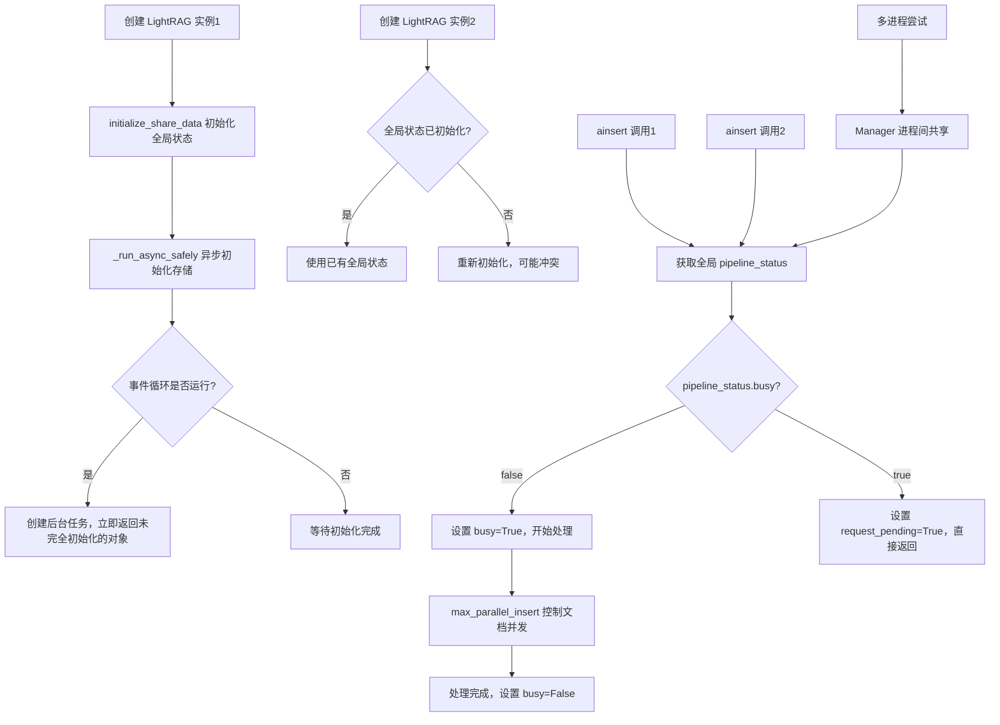

# LightRAG 并发控制机制深度解析

## 概述

LightRAG 存在多层次的架构设计问题，使其**无法支持真正的并发操作**。本文将系统性地分析这些限制并提供可行的解决方案。

## 🚨 核心问题：四道无法逾越的并发屏障

LightRAG 的并发限制来自四个层面，每一层都足以阻止真正的并发执行：

### 1. 异步初始化缺陷（🔥 根本性问题）

**问题描述**：在异步环境中创建 LightRAG 实例时，会返回一个尚未完全初始化的对象。

**核心代码分析**：
```python
# lightrag/lightrag.py
def __post_init__(self):
    initialize_share_data()  # 修改全局状态
    # ... 其他初始化 ...
    if self.auto_manage_storages_states:  # 默认为True
        self._run_async_safely(self.initialize_storages, "Storage Initialization")

def _run_async_safely(self, async_func, action_name=""):
    loop = always_get_an_event_loop()
    if loop.is_running():
        # 🚫 创建后台任务但不等待完成！
        task = loop.create_task(async_func())
        task.add_done_callback(lambda t: logger.info(f"{action_name} completed!"))
        # __post_init__ 在这里直接返回，对象可能未完全初始化
    else:
        # 仅在同步环境中会等待完成
        loop.run_until_complete(async_func())
```

**失败场景**：
```python
# ❌ 在异步环境中（如 Jupyter、FastAPI、或 async 函数中）
async def problematic_usage():
    rag1 = LightRAG(working_dir="./rag1")  # 返回未完全初始化的对象
    rag2 = LightRAG(working_dir="./rag2")  # 同样返回未完全初始化的对象
    
    # 此时两个实例的 initialize_storages 可能还在后台运行
    # 立即使用会导致不可预测的错误
    await rag1.ainsert(["测试文档"])  # 可能失败
```

### 2. 全局状态冲突（🚫 架构性问题）

**问题描述**：所有 LightRAG 实例共享模块级全局变量，无法实现真正的隔离。

**共享的全局状态**：
```python
# lightrag/kg/shared_storage.py - 模块级全局变量
_is_multiprocess = None
_manager = None 
_shared_dicts: Optional[Dict[str, Any]] = None
_pipeline_status_lock: Optional[LockType] = None
_storage_lock: Optional[LockType] = None
_graph_db_lock: Optional[LockType] = None
_initialized = None

def initialize_share_data(workers: int = 1):
    global _manager, _shared_dicts, _pipeline_status_lock, _initialized
    
    if _initialized:  # 第二个实例遇到这个检查
        direct_log("Shared-Data already initialized")
        return  # 但可能不符合第二个实例的期望
    
    # 初始化全局共享状态（所有实例共享）
    if workers > 1:
        _manager = Manager()
        _pipeline_status_lock = _manager.Lock()  # 进程间共享锁
        _shared_dicts = _manager.dict()          # 进程间共享字典
    else:
        _pipeline_status_lock = asyncio.Lock()   # 同进程内共享锁
        _shared_dicts = {}                       # 同进程内共享字典
```

**结果**：即使是不同 `working_dir` 的实例，也会共享同一套全局状态。

### 3. 全局管道互斥锁（🚫 设计性限制）

**问题描述**：`pipeline_status["busy"]` 作为全局互斥标志，确保任何时候只有一个 `ainsert` 操作能执行。

**关键代码**：
```python
# lightrag/lightrag.py - apipeline_process_enqueue_documents
async def apipeline_process_enqueue_documents(self, ...):
    # 获取全局共享的管道状态
    pipeline_status = await get_namespace_data("pipeline_status")  # 全局共享
    pipeline_status_lock = get_pipeline_status_lock()              # 全局共享锁
    
    async with pipeline_status_lock:
        if not pipeline_status.get("busy", False):
            # 🔥 设置全局忙碌标志，阻止所有其他实例
            pipeline_status["busy"] = True
            # 开始处理文档...
        else:
            # 🚫 其他所有 ainsert 调用都会被阻塞
            pipeline_status["request_pending"] = True
            logger.info("Another process is already processing. Request queued.")
            return  # 直接返回，无法并发！
```

**结果**：无论创建多少个 LightRAG 实例，同时只能有一个在执行 `ainsert` 操作。

### 4. 多进程共享限制（🚫 无法绕过）

**问题描述**：即使使用多进程，LightRAG 仍通过 `multiprocessing.Manager` 共享状态。

**代码分析**：
```python
# 多进程模式下仍然共享状态
if workers > 1:
    _is_multiprocess = True
    _manager = Manager()                    # 创建进程间通信管理器
    _pipeline_status_lock = _manager.Lock() # 🚫 所有进程共享这个锁！
    _shared_dicts = _manager.dict()         # 🚫 所有进程共享这个字典！
```

**结果**：多进程仍然受全局 `pipeline_status["busy"]` 限制，无法实现真正的并发。

## 📊 max_parallel_insert 的真实作用

**常见误解**：认为 `max_parallel_insert` 控制多个 `ainsert` 调用的并发。

**实际情况**：`max_parallel_insert` 只控制**单个 `ainsert` 调用内部**的文档级并发。

**代码证据**：
```python
# 只有通过全局互斥检查后，max_parallel_insert 才生效
async def apipeline_process_enqueue_documents(self, ...):
    # 前面的全局互斥检查通过后...
    
    # 🔥 max_parallel_insert 只在这里控制单个批次内的文档并发
    semaphore = asyncio.Semaphore(self.max_parallel_insert)  # 默认2
    
    async def process_document(doc_id, status_doc, semaphore, ...):
        async with semaphore:  # 📋 文档级别并发控制
            # 处理单个文档的所有 chunks
            chunks = self.chunking_func(...)
            await self._process_entity_relation_graph(chunks, ...)
    
    # 为单个 ainsert 调用中的每个文档创建任务
    doc_tasks = []
    for doc_id, status_doc in to_process_docs.items():
        doc_tasks.append(process_document(doc_id, status_doc, semaphore, ...))
    
    await asyncio.gather(*doc_tasks)  # 在单个 ainsert 内部并发
```

**正确理解**：
```python
# ✅ max_parallel_insert 的实际作用
await rag.ainsert([
    "document1",    # 这些文档在单个 ainsert 内部
    "document2",    # 受 max_parallel_insert=2 控制  
    "document3",    # 最多2个文档同时处理
    "document4",    # 其他文档等待前面的完成
])

# ❌ 不能控制多个 ainsert 调用的并发
await asyncio.gather(
    rag1.ainsert(["doc1"]),  # 第一个执行
    rag2.ainsert(["doc2"])   # 被全局锁阻塞
)
```

## 🎯 完整的并发限制流程图



## ✅ 可行的解决方案

基于以上分析，只有以下方案能实现真正的并发：

### 方案1：完全隔离的子进程（推荐）

**原理**：为每个任务启动独立的 Python 解释器进程，确保完全隔离。

```python
import subprocess
import json
import tempfile
import concurrent.futures

class IsolatedLightRAG:
    """使用完全隔离的子进程运行 LightRAG"""
    
    def __init__(self, working_dir: str):
        self.working_dir = working_dir
    
    def process_documents(self, documents: list[str]) -> dict:
        """通过子进程处理文档"""
        # 创建处理脚本
        script = f'''
import asyncio
import json
from lightrag import LightRAG

async def main():
    rag = LightRAG(working_dir="{self.working_dir}")
    await rag.ainsert({json.dumps(documents)})
    return {{"status": "success", "count": {len(documents)}}}

result = asyncio.run(main())
print(json.dumps(result))
'''
        
        # 启动独立的 Python 进程
        result = subprocess.run([
            "python", "-c", script
        ], capture_output=True, text=True)
        
        if result.returncode == 0:
            return json.loads(result.stdout.strip())
        else:
            return {"status": "error", "error": result.stderr}

# 使用示例：真正的并发处理
def parallel_processing():
    """多个文档批次的并发处理"""
    document_batches = [
        ["文档1", "文档2"],
        ["文档3", "文档4"], 
        ["文档5", "文档6"]
    ]
    
    rags = [
        IsolatedLightRAG(f"./rag_{i}") 
        for i in range(len(document_batches))
    ]
    
    # 使用线程池并发执行（每个线程启动一个子进程）
    with concurrent.futures.ThreadPoolExecutor() as executor:
        futures = [
            executor.submit(rag.process_documents, docs)
            for rag, docs in zip(rags, document_batches)
        ]
        
        results = [future.result() for future in futures]
    
    return results

# 运行并发处理
results = parallel_processing()
print("并发处理结果:", results)
```

### 方案2：基于消息队列的任务分发（生产级）

**原理**：使用 Celery 等任务队列，每个 worker 运行在独立进程中。

```python
from celery import Celery
import asyncio

app = Celery('lightrag_tasks', broker='redis://localhost:6379')

@app.task
def process_documents_task(documents, working_dir):
    """在独立的 Celery worker 中处理文档"""
    def run_lightrag():
        from lightrag import LightRAG
        
        rag = LightRAG(working_dir=working_dir)
        
        # 创建新的事件循环（避免与 Celery 冲突）
        loop = asyncio.new_event_loop()
        asyncio.set_event_loop(loop)
        
        try:
            result = loop.run_until_complete(rag.ainsert(documents))
            return {"status": "success", "working_dir": working_dir}
        except Exception as e:
            return {"status": "error", "error": str(e)}
        finally:
            loop.close()
    
    return run_lightrag()

# 使用示例
def distribute_processing():
    """分发任务到多个 Celery worker"""
    document_batches = [
        ["文档1", "文档2"],
        ["文档3", "文档4"],
        ["文档5", "文档6"]
    ]
    
    # 提交任务到队列
    jobs = []
    for i, docs in enumerate(document_batches):
        job = process_documents_task.delay(docs, f"./rag_{i}")
        jobs.append(job)
    
    # 等待所有任务完成
    results = [job.get() for job in jobs]
    return results
```

### 方案3：自实现无状态版本（长期方案）

**原理**：提取 LightRAG 的核心算法，重新实现为无全局状态的版本。

```python
import asyncio
from typing import List, Dict, Any

class StatelessLightRAG:
    """无全局状态的 LightRAG 实现"""
    
    def __init__(self, working_dir: str):
        self.working_dir = working_dir
        # 所有状态都是实例本地的，无全局依赖
        self.tokenizer = self._init_tokenizer()
        self.llm_func = self._init_llm()
        self.embedding_func = self._init_embedding()
    
    async def ainsert(self, documents: List[str]) -> Dict[str, Any]:
        """完全无状态的文档插入"""
        results = []
        
        # 并发处理多个文档（无全局状态限制）
        tasks = [self._process_document(doc) for doc in documents]
        doc_results = await asyncio.gather(*tasks)
        
        return {
            "results": doc_results, 
            "total_documents": len(documents)
        }
    
    async def _process_document(self, document: str) -> Dict[str, Any]:
        """处理单个文档"""
        # 1. 文档分块
        chunks = self._chunk_document(document)
        
        # 2. 并发实体抽取（无全局状态限制）
        entity_tasks = [
            self._extract_entities_from_chunk(chunk) 
            for chunk in chunks
        ]
        chunk_results = await asyncio.gather(*entity_tasks)
        
        # 3. 实体关系合并
        merged_entities = self._merge_entities(chunk_results)
        
        # 4. 存储到本地（无共享状态）
        await self._store_to_local(merged_entities, document)
        
        return {
            "document_summary": document[:100] + "...",
            "entities_count": len(merged_entities),
            "status": "success"
        }
    
    # 实现核心算法但无全局状态依赖
    def _chunk_document(self, content: str) -> List[Dict[str, Any]]:
        """复用 LightRAG 的分块逻辑"""
        pass
    
    async def _extract_entities_from_chunk(self, chunk: Dict[str, Any]):
        """复用 LightRAG 的实体抽取逻辑"""
        pass
    
    def _merge_entities(self, chunk_results: List[Dict[str, Any]]):
        """复用 LightRAG 的实体合并逻辑"""
        pass

# 真正并发的使用示例
async def truly_concurrent_processing():
    """同时处理多个文档集合"""
    rags = [
        StatelessLightRAG(f"./stateless_rag_{i}")
        for i in range(3)
    ]
    
    document_batches = [
        ["文档1", "文档2"],
        ["文档3", "文档4"],
        ["文档5", "文档6"]
    ]
    
    # 真正的并发执行（无全局状态限制）
    tasks = [
        rag.ainsert(docs) 
        for rag, docs in zip(rags, document_batches)
    ]
    
    results = await asyncio.gather(*tasks)
    return results

# 运行示例
if __name__ == "__main__":
    results = asyncio.run(truly_concurrent_processing())
    print("真正并发的处理结果:", results)
```

## 📋 总结

### LightRAG 的根本性限制

1. **🔥 异步初始化缺陷**：在异步环境中返回未完全初始化的对象
2. **🚫 全局状态冲突**：所有实例共享模块级全局变量，无法隔离
3. **🚫 全局管道互斥**：`pipeline_status["busy"]` 确保同时只有一个 `ainsert` 执行
4. **🚫 多进程共享限制**：Manager 机制使多进程也受全局状态限制

### 关键洞察

- **设计哲学**：LightRAG 针对**单实例、单用户、批量处理**场景设计
- **参数误解**：`max_parallel_insert` 不控制多个 `ainsert` 的并发
- **架构缺陷**：从事件循环管理到全局状态设计都存在并发障碍

### 推荐方案

- **短期方案**：使用完全隔离的子进程
- **生产方案**：基于 Celery 等消息队列的任务分发
- **长期方案**：基于 LightRAG 算法重新实现无全局状态版本

**核心建议**：如果需要高并发处理，将 LightRAG 视为算法参考，而不是直接在并发场景中使用。设计适合的架构来绕过其固有的限制，或考虑重新实现其核心功能。