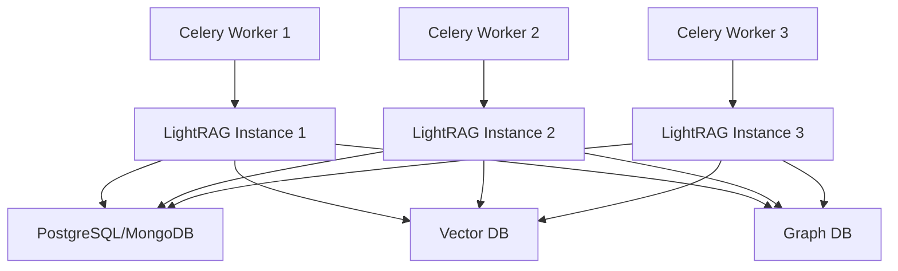

# LightRAG 无状态化改造方案

## 核心理念

将LightRAG从一个有状态的文档管理系统改造为**无状态的图索引构建服务**。每次调用都是独立的，不依赖任何全局状态或实例状态。

## 现状问题

1. **全局状态污染**：`shared_storage.py` 的全局变量导致并发冲突
2. **文档管理复杂**：内置的文档扫描、状态管理增加了不必要的复杂度
3. **接口过于综合**：`ainsert` 混合了文档管理、分块、实体抽取等多个职责
4. **并发限制**：`pipeline_status["busy"]` 全局锁导致无法真正并发

## 改造方案

### 1. 接口拆分设计

将现有的 `ainsert` 拆分为三个独立的无状态接口：

#### 1.1 ainsert_document
```python
async def ainsert_document(
    self,
    documents: List[str],
    doc_ids: List[str],
    file_paths: List[str],
) -> Dict[str, Any]:
    """
    纯粹的文档写入功能
    - 写入 full_docs
    - 写入 doc_status
    - 返回文档元数据
    """
    # 无状态实现，直接写入存储
    pass
```

#### 1.2 aprocess_chunking
```python
async def aprocess_chunking(
    self,
    doc_id: str,
    content: str,
    file_path: str,
    split_by_character: Optional[str] = None,
) -> List[Dict[str, Any]]:
    """
    纯粹的文档分块功能
    - 执行 chunking_func
    - 写入 chunks_vdb 和 text_chunks
    - 返回 chunks 列表
    """
    # 无状态实现，不依赖任何全局状态
    pass
```

#### 1.3 aprocess_graph_indexing
```python
async def aprocess_graph_indexing(
    self,
    chunks: List[Dict[str, Any]],
    collection_id: str,
) -> Dict[str, Any]:
    """
    核心图索引构建功能
    - 实体抽取
    - 关系抽取
    - 实体/关系合并
    - 写入 entities_vdb 和 relationships_vdb
    """
    # 完全无状态，每次调用独立
    pass
```

### 2. 无状态化实现策略

#### 2.1 移除所有全局状态
```python
# 删除或重构以下内容：
# - shared_storage.py 的所有全局变量
# - pipeline_status 相关逻辑
# - 文档扫描循环
# - 全局锁机制
```

#### 2.2 简化初始化
```python
class LightRAG:
    def __init__(self, working_dir: str, workspace: str):
        # 只初始化存储连接
        # 不创建任何共享状态
        # 不启动后台任务
        self.working_dir = working_dir
        self.workspace = workspace
        self._init_storages()  # 同步初始化
```

#### 2.3 每个方法独立运行
- 不检查 busy 状态
- 不等待其他操作
- 不共享任何状态
- 每次调用都是幂等的

### 3. Celery 集成方案

#### 3.1 任务定义
```python
@app.task
def process_document_task(
    document: str,
    doc_id: str,
    collection_id: str,
    file_path: str
):
    """处理单个文档的 Celery 任务"""
    # 1. 创建 LightRAG 实例（无状态）
    rag = LightRAG(
        working_dir=f"./lightrag_cache/{collection_id}",
        workspace=collection_id
    )
    
    # 2. 写入文档（可选，用于兼容性）
    await rag.ainsert_document([document], [doc_id], [file_path])
    
    # 3. 文档分块
    chunks = await rag.aprocess_chunking(doc_id, document, file_path)
    
    # 4. 构建图索引（核心）
    result = await rag.aprocess_graph_indexing(chunks, collection_id)
    
    return result
```

#### 3.2 并发处理
```python
@app.task
def process_collection_documents(
    documents: List[Tuple[str, str, str]],  # (content, doc_id, file_path)
    collection_id: str
):
    """并发处理多个文档"""
    # 每个文档独立处理，无状态竞争
    tasks = []
    for content, doc_id, file_path in documents:
        task = process_document_task.delay(
            content, doc_id, collection_id, file_path
        )
        tasks.append(task)
    
    # 等待所有任务完成
    results = [task.get() for task in tasks]
    return results
```

### 4. 实施步骤

#### 第一步：接口拆分（保持向后兼容）
1. 实现三个新接口
2. 修改 `ainsert` 调用新接口
3. 测试兼容性

#### 第二步：移除全局状态
1. 删除 `shared_storage.py` 的使用
2. 移除 `pipeline_status` 相关代码
3. 删除文档扫描循环

#### 第三步：简化初始化
1. 移除异步初始化
2. 删除后台任务
3. 简化存储初始化

#### 第四步：Celery 集成
1. 创建专门的任务模块
2. 实现文档处理任务
3. 测试并发处理

### 5. 最终架构



每个 Worker 创建独立的 LightRAG 实例，完全无状态，可以真正并发处理。

### 6. 优势总结

1. **真正的无状态**：每次调用独立，无全局依赖
2. **完美的并发**：没有任何锁或状态冲突
3. **简单的接口**：职责单一，易于理解和使用
4. **灵活的集成**：可以按需调用特定功能
5. **水平扩展**：添加更多 Worker 即可提升处理能力

### 7. 迁移建议

1. **保持向后兼容**：旧的 `ainsert` 接口继续工作
2. **渐进式迁移**：先使用新接口，再移除旧代码
3. **充分测试**：确保无状态化不影响核心功能
4. **监控性能**：对比改造前后的性能指标

## 代码示例

### 无状态的 aprocess_graph_indexing 实现
```python
async def aprocess_graph_indexing(
    self,
    chunks: List[Dict[str, Any]],
    collection_id: str,
) -> Dict[str, Any]:
    """无状态的图索引构建"""
    
    # 1. 实体和关系抽取（核心算法）
    chunk_results = await extract_entities(
        chunks,
        global_config=asdict(self),
        # 不传递 pipeline_status 相关参数
    )
    
    # 2. 合并实体和关系
    await merge_nodes_and_edges(
        chunk_results=chunk_results,
        knowledge_graph_inst=self.chunk_entity_relation_graph,
        entity_vdb=self.entities_vdb,
        relationships_vdb=self.relationships_vdb,
        global_config=asdict(self),
        # 不传递 pipeline_status 相关参数
    )
    
    # 3. 返回处理结果
    return {
        "status": "success",
        "collection_id": collection_id,
        "chunks_processed": len(chunks),
        "timestamp": datetime.utcnow().isoformat()
    }
```

### Celery 任务示例
```python
from celery import Celery
from aperag.graph.lightrag import LightRAG

app = Celery('lightrag_tasks', broker='redis://localhost:6379')

@app.task
async def build_graph_index(
    chunks: List[Dict[str, Any]],
    collection_id: str,
    working_dir: str
) -> Dict[str, Any]:
    """构建图索引的 Celery 任务"""
    
    # 创建无状态的 LightRAG 实例
    rag = LightRAG(
        working_dir=working_dir,
        workspace=collection_id,
        # 关闭自动状态管理
        auto_manage_storages_states=False
    )
    
    # 同步初始化存储
    await rag.initialize_storages()
    
    # 执行图索引构建
    result = await rag.aprocess_graph_indexing(chunks, collection_id)
    
    # 清理资源
    await rag.finalize_storages()
    
    return result
```

## 总结

无状态化改造将 LightRAG 从一个复杂的文档管理系统转变为专注的图索引构建服务。这种设计更适合在分布式环境中使用，能够充分利用 Celery 等任务队列的并发能力，实现真正的水平扩展。 