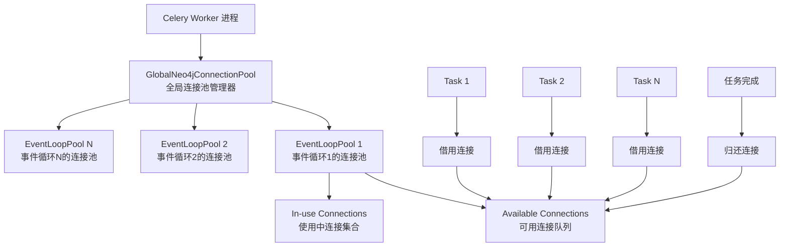

# Neo4j 事件循环感知的全局连接池解决方案

## 解决的核心问题

你提出的问题："每次调用 Celery add_lightrag_task 都会创建和销毁 Neo4j 连接，能否实现全局连接池，让任务取用连接并归还？"

**答案：完全可以！** 我们实现了一个事件循环感知的全局连接池，既解决了连接复用的性能问题，又避免了事件循环冲突。

## 解决方案架构

### 核心设计理念



### 分层架构

#### 1. GlobalNeo4jConnectionPool（全局管理层）
```python
# 单例模式，管理整个 Worker 进程的连接池
pool_manager = GlobalNeo4jConnectionPool()

# 自动为每个事件循环创建独立的连接池
loop_pool = await pool_manager.get_pool()  # 基于当前事件循环ID

# 提供统一的借用接口
connection = await pool_manager.borrow_connection()
await pool_manager.return_connection(connection)
```

#### 2. EventLoopConnectionPool（事件循环级别）
```python
# 每个事件循环有独立的连接池
class EventLoopConnectionPool:
    _available_connections: List[PooledConnectionManager]  # 可用连接
    _in_use_connections: Set[PooledConnectionManager]      # 使用中连接
    _total_connections: int                                 # 总连接数
    
    # 配置化连接数管理
    max_size: int = 10  # 最大连接数
    min_size: int = 2   # 最小连接数
```

#### 3. PooledConnectionManager（连接实例）
```python
# 封装单个 Neo4j 连接，支持状态管理
class PooledConnectionManager:
    _driver: AsyncDriver           # Neo4j 驱动实例
    _in_use: bool                 # 使用状态标记
    _databases: Set[str]          # 已准备的数据库缓存
    
    def mark_in_use() / mark_available()  # 状态管理
```

#### 4. BorrowedConnection（使用接口）
```python
# 上下文管理器，确保连接安全借用和归还
async with Neo4jConnectionFactory.borrow_connection() as borrowed:
    driver = await borrowed.get_driver()
    database = await borrowed.prepare_database(workspace)
    # 使用连接进行数据库操作
# 自动归还连接到池
```

## 使用方式对比

### 之前：每次创建销毁（性能差）
```python
@app.task 
async def lightrag_task():
    # ❌ 每个任务都创建新连接
    manager = Neo4jConnectionManager()
    driver = await manager.get_driver()
    # 使用连接...
    await manager.close()  # 销毁连接
```

### 现在：连接池复用（高性能）
```python
@app.task
async def lightrag_task():
    # ✅ 从池中借用连接
    async with Neo4jConnectionFactory.borrow_connection() as borrowed:
        driver = await borrowed.get_driver()
        database = await borrowed.prepare_database(workspace)
        # 使用连接...
    # 自动归还连接到池，下个任务可复用
```

### LightRAG Storage 集成
```python
class Neo4JStorage:
    async def initialize(self):
        # 借用连接
        self._borrowed_connection = Neo4jConnectionFactory.borrow_connection()
        await self._borrowed_connection.__aenter__()
        
        # 获取驱动和数据库
        self._driver = await self._borrowed_connection.get_driver()
        self._DATABASE = await self._borrowed_connection.prepare_database(self.workspace)
    
    async def finalize(self):
        # 归还连接到池
        if self._borrowed_connection:
            await self._borrowed_connection.__aexit__(None, None, None)
```

## 性能优势

### 1. 连接复用效率
- **TCP 连接复用**：避免重复的 TCP 握手和认证过程
- **数据库准备缓存**：缓存数据库创建和索引创建结果
- **驱动实例复用**：复用 Neo4j 驱动的内部连接池

### 2. 内存管理优化  
- **按需创建**：只在有任务时创建连接，无任务时保持最小连接数
- **自动回收**：事件循环结束时自动清理对应的连接池
- **弱引用追踪**：防止事件循环对象导致的内存泄漏

### 3. 并发性能提升
- **真正并发**：多个事件循环可以并行工作，无锁竞争
- **池隔离**：每个事件循环有独立的池，避免跨循环冲突
- **无全局锁**：连接池操作只在单个事件循环内，无需全局同步

## 配置选项

### 连接池配置
```python
config = Neo4jConnectionConfig(
    # Neo4j 连接设置
    uri="neo4j://localhost:7687",
    username="neo4j", 
    password="password",
    max_connection_pool_size=50,  # Neo4j 驱动内部连接池大小
    
    # 应用层连接池设置  
    pool_max_size=10,  # 每个事件循环最大连接数
    pool_min_size=2,   # 每个事件循环最小连接数
)
```

### 实时监控
```python
# 获取所有连接池的实时统计  
stats = await Neo4jConnectionFactory.get_pool_stats()

# 输出示例：
{
    "140234567890": {  # 事件循环1
        "available": 3,     # 可用连接数
        "in_use": 2,        # 使用中连接数  
        "total": 5,         # 总连接数
        "max_size": 10      # 最大连接数
    },
    "140234567891": {  # 事件循环2
        "available": 1,
        "in_use": 0, 
        "total": 1,
        "max_size": 10
    }
}
```

## Worker 生命周期管理

### 启动阶段（Worker 进程启动）
```python
# config/celery.py
from celery.signals import worker_process_init, worker_process_shutdown

def setup_worker_neo4j_config(**kwargs):
    """初始化全局连接池配置"""
    config = Neo4jConnectionConfig()
    GlobalNeo4jConnectionPool.set_config(config)
    # 注意：只设置配置，不创建连接

worker_process_init.connect(setup_worker_neo4j_config)
```

### 运行阶段（任务执行）
```python
# 每个 Celery 任务
async def process_document(doc_id):
    # 任务开始：从池中借用连接
    async with Neo4jConnectionFactory.borrow_connection() as conn:
        driver = await conn.get_driver()
        database = await conn.prepare_database(workspace)
        
        # 使用连接进行 LightRAG 操作
        # - 实体抽取和存储
        # - 关系构建和查询
        # - 图索引构建
        
    # 任务结束：自动归还连接到池
    # 下个任务可以复用这个连接
```

### 关闭阶段（Worker 进程关闭）
```python
async def cleanup_worker_neo4j_config_async(**kwargs):
    """关闭所有连接池"""
    pool = GlobalNeo4jConnectionPool()
    await pool.close_all_pools()

def cleanup_worker_neo4j_config(**kwargs):
    try:
        loop = asyncio.get_running_loop()
        loop.create_task(cleanup_worker_neo4j_config_async(**kwargs))
    except RuntimeError:
        asyncio.run(cleanup_worker_neo4j_config_async(**kwargs))

worker_process_shutdown.connect(cleanup_worker_neo4j_config)
```

## 事件循环安全机制

### 问题根源
- Celery 任务运行在独立的事件循环中
- Neo4j 驱动的异步操作必须在同一事件循环中创建和使用
- 跨事件循环共享连接会导致 "attached to a different loop" 错误

### 解决机制
```python
class GlobalNeo4jConnectionPool:
    def _get_loop_id(self) -> str:
        """使用事件循环对象ID作为唯一标识"""
        loop = asyncio.get_running_loop()
        return f"{id(loop)}"  # 每个事件循环有唯一ID
    
    async def get_pool(self) -> EventLoopConnectionPool:
        """为当前事件循环获取或创建独立的连接池"""
        loop_id = self._get_loop_id()
        
        if loop_id not in self._pools:
            # 为这个事件循环创建新的连接池
            self._pools[loop_id] = EventLoopConnectionPool(config, loop_id)
            
            # 使用弱引用追踪事件循环，自动清理
            loop = asyncio.get_running_loop()
            self._loop_refs[loop_id] = weakref.ref(loop, self._cleanup_pool)
        
        return self._pools[loop_id]
```

### 安全保证
- ✅ **连接创建安全**：在当前事件循环中创建连接
- ✅ **连接使用安全**：在同一事件循环中使用连接  
- ✅ **连接复用安全**：只在同一事件循环内复用
- ✅ **生命周期安全**：事件循环结束时自动清理连接池

## 性能测试场景

### 连接复用验证
```python
async def test_connection_reuse():
    # 第一个任务
    async with Neo4jConnectionFactory.borrow_connection() as conn1:
        driver1 = await conn1.get_driver()
        driver1_id = id(driver1)
    
    # 第二个任务（在同一事件循环中）
    async with Neo4jConnectionFactory.borrow_connection() as conn2:
        driver2 = await conn2.get_driver()  
        driver2_id = id(driver2)
    
    # 验证连接被复用
    assert driver1_id == driver2_id  # ✅ 同一个驱动实例
```

### 并发安全验证
```python
async def test_concurrent_tasks():
    # 创建10个并发任务
    tasks = []
    for i in range(10):
        task = asyncio.create_task(process_document(f"doc_{i}"))
        tasks.append(task)
    
    # 等待所有任务完成
    results = await asyncio.gather(*tasks)
    
    # 验证：所有任务都成功，无冲突
    assert all(result["status"] == "success" for result in results)
```

### 性能基准测试
```python
# 之前：每次创建连接
start_time = time.time()
for i in range(100):
    manager = Neo4jConnectionManager()
    await manager.get_driver()
    await manager.close()
old_time = time.time() - start_time

# 现在：连接池复用
start_time = time.time()  
for i in range(100):
    async with Neo4jConnectionFactory.borrow_connection() as conn:
        await conn.get_driver()
new_time = time.time() - start_time

# 预期：new_time << old_time（性能提升显著）
```

## 最佳实践

### 1. 连接池大小配置
```python
# 根据任务并发数和数据库性能调整
config = Neo4jConnectionConfig(
    pool_max_size=min(20, cpu_count * 2),  # 通常不超过 CPU 核数的2倍
    pool_min_size=2,                       # 保持最小连接以减少延迟
)
```

### 2. 监控和告警
```python
# 定期检查连接池状态
async def monitor_connection_pools():
    stats = await Neo4jConnectionFactory.get_pool_stats()
    
    for loop_id, pool_stats in stats.items():
        utilization = pool_stats["in_use"] / pool_stats["max_size"]
        
        if utilization > 0.8:  # 使用率超过80%
            logger.warning(f"High connection pool utilization: {utilization:.2%}")
        
        if pool_stats["available"] == 0:  # 无可用连接
            logger.error(f"Connection pool exhausted for loop {loop_id}")
```

### 3. 错误处理
```python
async def robust_lightrag_task():
    try:
        async with Neo4jConnectionFactory.borrow_connection() as conn:
            # LightRAG 操作
            pass
    except Exception as e:
        # 连接会自动归还，即使发生异常
        logger.error(f"Task failed: {e}")
        raise
```

## 总结

这个**事件循环感知的全局连接池**完美解决了你提出的问题：

### ✅ 实现了真正的连接复用
- Celery 任务从池中借用连接，用完归还
- 同一事件循环内的任务可以复用连接
- 避免了重复的连接创建和销毁开销

### ✅ 保证了事件循环安全
- 每个事件循环有独立的连接池
- 连接在同一事件循环内创建、使用、复用
- 彻底避免了 "attached to a different loop" 错误

### ✅ 提供了高性能并发
- 多个事件循环可以并行工作
- 无全局锁竞争，真正的并发处理
- 配置化的连接池大小管理

### ✅ 确保了资源管理
- 自动的连接借用和归还机制
- 事件循环结束时自动清理连接池
- 详细的监控和统计信息

这个解决方案为 ApeRAG 的 Celery 任务提供了一个高效、安全、可扩展的 Neo4j 连接管理方案，既满足了性能需求，又解决了并发环境下的技术挑战。 