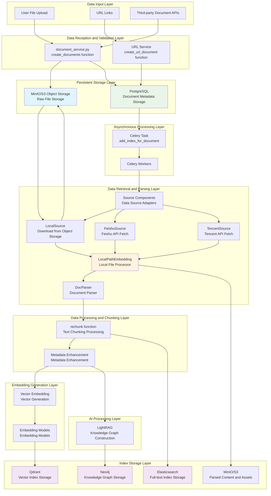

# ApeRAG Data Flow and Processing Architecture

## Overview

This document describes the ApeRAG system from a **data flow** perspective, detailing how various types of data (raw documents, parsed content, vector embeddings, full-text indexes, knowledge graphs) flow and are processed between different components. It emphasizes what specific operations each component performs on data and where data is stored and transmitted.

## Data Types and Storage Locations

### Core Data Types
1. **Raw Document Data**: User-uploaded files (PDF, Word, HTML, etc.)
2. **Parsed Structured Data**: Text content, title hierarchy, images and other assets
3. **Text Chunk Data**: Text fragments processed through chunking
4. **Vector Data**: Embedding vector representations of text chunks
5. **Full-text Index Data**: Inverted indexes for full-text search
6. **Knowledge Graph Data**: Entities, relationships, and subgraph structures

### Storage Location Mapping
```
Raw Documents → MinIO/S3 Object Storage
Document Metadata → PostgreSQL Database
Parsed Content and Assets → MinIO/S3 Object Storage
Vector Data → Qdrant Vector Database
Full-text Index → Elasticsearch
Knowledge Graph → Neo4j Graph Database
Task Status and Cache → Redis
```

## Data Flow Architecture Diagram



## Detailed Data Flow Process

### Stage 1: Data Reception and Initial Storage

#### 1.1 File Upload Processing (`document_service.py::create_documents`)
**Input Data**: Raw file streams uploaded by users
**Processing Component**: `aperag.service.document_service.create_documents`

**Data Flow Process**:
```python
# 1. Receive file data
files: List[UploadedFile]  # Raw file streams

# 2. Validate and create Document instance
document_instance = db_models.Document(
    user=user,
    name=item.name,
    status=db_models.Document.Status.PENDING,
    size=item.size,
    collection_id=collection.id,
)
await document_instance.asave()  # → PostgreSQL

# 3. Upload raw file to object storage
obj_store = get_object_store()  # MinIO/S3 client
upload_path = f"{document_instance.object_store_base_path()}/original{file_suffix}"
await sync_to_async(obj_store.put)(upload_path, item)  # → MinIO/S3

# 4. Update document metadata
document_instance.object_path = upload_path
document_instance.metadata = json.dumps({"object_path": upload_path})
await document_instance.asave()  # → PostgreSQL
```

**Data Storage Result**:
- Raw File: `MinIO/S3: /{document_id}/original.{extension}`
- Document Metadata: `PostgreSQL: documents table`

#### 1.2 URL Document Processing (`document_service.py::create_url_document`)
**Input Data**: URL strings
**Processing Component**: `aperag.service.document_service.create_url_document`

**Data Flow Process**:
```python
# 1. Create document record (without immediate content download)
document_instance = db_models.Document(
    user=user,
    name=url + ".html",
    status=db_models.Document.Status.PENDING,
    collection_id=collection.id,
    size=0,  # Initial size is 0
)
await document_instance.asave()  # → PostgreSQL

# 2. Save URL metadata
document_instance.metadata = json.dumps({"url": json.dumps(url)})
await document_instance.asave()  # → PostgreSQL

# 3. Trigger crawler task
crawl_domain.delay(url, url, collection_id, user, max_pages=2)  # → Celery queue
```

### Stage 2: Asynchronous Task Triggering and File Retrieval

#### 2.1 Index Task Startup (`tasks/index.py::add_index_for_document`)
**Input Data**: `document_id`
**Processing Component**: `aperag.tasks.index.add_index_for_document`

**Data Flow Process**:
```python
# 1. Load document information from database
document = Document.objects.get(id=document_id)  # ← PostgreSQL
metadata = json.loads(document.metadata)

# 2. Get collection configuration
collection = async_to_sync(document.get_collection)()  # ← PostgreSQL
config = parseCollectionConfig(collection.config)

# 3. Initialize Source component
source = get_source(config)  # Get corresponding Source implementation based on config
```

#### 2.2 File Download and Localization (Source Components)
**Input Data**: Object storage paths or third-party API parameters
**Processing Component**: `aperag.source.{local/feishu/tencent}.Source`

**LocalSource Data Flow**:
```python
# LocalSource.prepare_document()
# 1. Download file from object storage
obj_store = get_object_store()
file_content = obj_store.get(document.object_path)  # ← MinIO/S3

# 2. Create local temporary file
local_temp_path = f"/tmp/aperag_{document_id}_{timestamp}"
with open(local_temp_path, 'wb') as f:
    f.write(file_content)  # → Local temporary file

# 3. Return local file description
return LocalDoc(path=local_temp_path, metadata=metadata)
```

**FeishuSource Data Flow**:
```python
# FeishuSource.prepare_document()
# 1. Call Feishu API to get document content
feishu_client = FeishuClient(app_id, app_secret)
doc_content = feishu_client.get_document(doc_id)  # ← Feishu API

# 2. Convert to local file
local_temp_path = f"/tmp/feishu_{doc_id}.html"
with open(local_temp_path, 'w') as f:
    f.write(doc_content)  # → Local temporary file

return LocalDoc(path=local_temp_path, metadata=metadata)
```

### Stage 3: Document Parsing and Structured Processing

#### 3.1 Document Parsing (`embed/local_path_embedding.py::LocalPathEmbedding`)
**Input Data**: Local file path
**Processing Component**: `aperag.embed.local_path_embedding.LocalPathEmbedding`

**Data Flow Process**:
```python
# LocalPathEmbedding.parse_doc()
# 1. File format detection and parsing
parser = DocParser()
filepath = Path(self.filepath)  # ← Local temporary file
parts = parser.parse_file(filepath, self.file_metadata)  # → List[Part]

# Returned parts include:
# - MarkdownPart: Main text content
# - AssetBinPart: Images, attachments and other binary assets
# - TextPart: Plain text fragments
```

**DocParser Parsing Result**:
```python
# For PDF files
parts = [
    MarkdownPart(markdown="# Title\nContent...", metadata={"source": "page_1"}),
    AssetBinPart(data=b"image_binary_data", asset_id="img_001"),
    TextPart(content="Table data", metadata={"type": "table"})
]
```

#### 3.2 Content Chunking (`docparser/chunking.py::rechunk`)
**Input Data**: List of parsed document parts
**Processing Component**: `aperag.docparser.chunking.rechunk`

**Data Flow Process**:
```python
# rechunk function processing
original_parts = [MarkdownPart, AssetBinPart, ...]  # ← DocParser output
chunked_parts = rechunk(
    original_parts, 
    chunk_size=self.chunk_size,      # e.g.: 1000
    chunk_overlap=self.chunk_overlap, # e.g.: 200
    tokenizer=self.tokenizer
)  # → List[TextPart]

# Chunking result example
chunked_parts = [
    TextPart(content="First text segment...", metadata={"chunk_id": 0, "titles": ["Chapter 1"]}),
    TextPart(content="Second text segment...", metadata={"chunk_id": 1, "titles": ["Chapter 1", "Section 1.1"]}),
    # ...
]
```

#### 3.3 Metadata Enhancement and Node Creation
**Input Data**: Chunked text parts
**Processing Component**: `LocalPathEmbedding.load_data`

**Data Flow Process**:
```python
# 1. Add context information to each text chunk
for part in chunked_parts:
    paddings = []
    
    # Add title hierarchy
    if "titles" in part.metadata:
        paddings.append("Breadcrumbs: " + " > ".join(part.metadata["titles"]))
    
    # Add user labels
    if "labels" in part.metadata:
        labels = [f"{item['key']}={item['value']}" for item in part.metadata.get("labels", [])]
        paddings.append(" ".join(labels))
    
    # Build final text
    prefix = "\n\n".join(paddings) if paddings else ""
    final_text = f"{prefix}\n\n{part.content}" if prefix else part.content
    
    # Create LlamaIndex node
    node = TextNode(text=final_text, metadata=part.metadata)
    nodes.append(node)  # → List[TextNode]
```

### Stage 4: Multi-modal Index Generation and Storage

#### 4.1 Vector Embedding Generation and Storage
**Input Data**: TextNode list
**Processing Component**: Embedding models + Qdrant connector

**Data Flow Process**:
```python
# 1. Extract text content
texts = [node.get_content() for node in nodes]  # → List[str]

# 2. Generate vector embeddings
vectors = self.embedding.embed_documents(texts)  # → List[List[float]]
# embedding may be OpenAI API or local model, generating 1536-dimensional vectors

# 3. Add vectors to nodes
for i, vector in enumerate(vectors):
    nodes[i].embedding = vector  # → TextNode with embedding

# 4. Store to Qdrant vector database
vector_ids = self.connector.store.add(nodes)  # → Qdrant
# Return vector ID list: ["vec_001", "vec_002", ...]

# 5. Update document related IDs
relate_ids = {"ctx": vector_ids}
document.relate_ids = json.dumps(relate_ids)  # → PostgreSQL
```

**Qdrant Storage Structure**:
```json
{
  "id": "vec_001",
  "vector": [0.1, 0.2, ...],  // 1536-dimensional vector
  "payload": {
    "text": "Enhanced text content",
    "metadata": {
      "source": "document_123",
      "chunk_id": 0,
      "titles": ["Chapter 1"]
    }
  }
}
```

#### 4.2 Full-text Index Creation
**Input Data**: Complete document content
**Processing Component**: `aperag.context.full_text.insert_document`

**Data Flow Process**:
```python
# 1. Get complete document content
if md_part:  # If there's a Markdown part
    content = md_part.markdown
else:  # Otherwise merge all text chunks
    content = "\n\n".join([part.content for part in chunked_parts])

# 2. Create full-text index
index_name = generate_fulltext_index_name(collection.id)  # "collection_123_fulltext"
insert_document(
    index=index_name,           # → Elasticsearch index name
    doc_id=document.id,         # → Document ID
    title=document.name,        # → Document title
    content=content             # → Complete text content
)  # → Elasticsearch
```

**Elasticsearch Storage Structure**:
```json
{
  "doc_id": "document_123",
  "title": "Example Document.pdf",
  "content": "Complete document text content...",
  "timestamp": "2024-01-01T00:00:00Z"
}
```

#### 4.3 Parsed Content and Asset Saving
**Input Data**: Parsed content and assets
**Processing Component**: MinIO/S3 object storage

**Data Flow Process**:
```python
if self.object_store_base_path:
    obj_store = get_object_store()
    base_path = self.object_store_base_path  # "document_123/"
    
    # 1. Save Markdown content
    md_upload_path = f"{base_path}/parsed.md"
    md_data = content.encode("utf-8")
    obj_store.put(md_upload_path, md_data)  # → MinIO/S3
    
    # 2. Save asset files
    for part in doc_parts:
        if isinstance(part, AssetBinPart):
            asset_upload_path = f"{base_path}/assets/{part.asset_id}"
            obj_store.put(asset_upload_path, part.data)  # → MinIO/S3
```

**Final Object Storage Structure**:
```
MinIO/S3:
  document_123/
    ├── original.pdf          # Original file
    ├── parsed.md            # Parsed Markdown content
    └── assets/
        ├── img_001.png      # Extracted images
        └── table_001.csv    # Extracted tables
```

### Stage 5: Knowledge Graph Construction (Optional)

#### 5.1 LightRAG Knowledge Graph Processing
**Input Data**: Complete document content
**Processing Component**: `aperag.tasks.index.add_lightrag_index_task`

**Data Flow Process**:
```python
# 1. Asynchronous LightRAG task
async def _async_add_lightrag_index():
    # Get LightRAG instance
    rag_holder = await lightrag_holder.get_lightrag_holder(collection)
    
    # 2. Insert document into LightRAG
    await rag_holder.ainsert(
        input=content,           # ← Complete document content
        ids=document_id,         # ← Document ID
        file_paths=file_path     # ← File path
    )  # → Neo4j + internal vector storage
    
    # 3. Verify processing result
    processed_docs = await rag_holder.get_processed_docs()
    assert str(document_id) in processed_docs
```

**Neo4j Storage Structure**:
```cypher
// Entity nodes
CREATE (e:Entity {
  id: "entity_001",
  name: "Beijing",
  type: "Location",
  description: "Capital of China"
})

// Relationships
CREATE (e1:Entity)-[:LOCATED_IN {
  source_doc: "document_123",
  confidence: 0.95
}]->(e2:Entity)
```

### Stage 6: Status Update and Resource Cleanup

#### 6.1 Document Status Management
**Data Flow**: Various index statuses → PostgreSQL

```python
# Update status in various processing stages
document.vector_index_status = Document.IndexStatus.COMPLETE     # Vector index complete
document.fulltext_index_status = Document.IndexStatus.COMPLETE   # Full-text index complete
document.graph_index_status = Document.IndexStatus.COMPLETE      # Graph index complete

# Calculate final status
document.update_overall_status()  # Calculate overall status based on various index statuses
document.save()  # → PostgreSQL
```

#### 6.2 Temporary File Cleanup
```python
# Source component cleanup
if local_doc and source:
    source.cleanup_document(local_doc.path)  # Delete local temporary files
    # os.remove("/tmp/aperag_123_timestamp")
```

## Data Integrity and Consistency Guarantees

### Transaction Management
- **PostgreSQL**: Document metadata updates use database transactions
- **Object Storage**: Update database paths after file upload
- **Vector Database**: Rollback document status on storage failure

### Error Recovery
- **Retry Mechanism**: Automatic retry on Celery task failure
- **Status Tracking**: Independent status management for each index
- **Data Cleanup**: Clean related data on failure

### Data Synchronization
- **Related ID Management**: Store ID mappings of various storage systems in PostgreSQL
- **Cascade Deletion**: Clean all related data when deleting documents
- **Consistency Check**: Periodic data integrity verification

## Performance Optimization Strategies

### Data Transfer Optimization
- **Streaming Processing**: Chunked transfer for large files
- **Compressed Storage**: Compressed storage for text content
- **Connection Pooling**: Database connection reuse

### Computational Resource Optimization
- **Batch Processing**: Batch embedding generation for multiple documents
- **Caching Mechanism**: Cache embedding models and parsing results
- **Parallel Processing**: Parallel processing with multiple Celery Workers

This data-centric architecture design ensures:
1. **Clear Data Flow**: Clear inputs and outputs for each component
2. **Separation of Concerns**: Components focus on specific data processing tasks
3. **Scalability**: Easy to add new data sources and storage backends
4. **Traceability**: Complete data processing pipeline can be traced

## Known Architectural Issues and Improvement Plans

### Current Architecture Limitations

While the current data flow architecture works well, there is an important design issue: **The `LocalPathEmbedding` class takes on too many responsibilities, and its data interface design limits reuse by other index types**.

#### Core Problem
The `LocalPathEmbedding.load_data()` method concentrates multiple processing steps:
```python
def load_data(self) -> Tuple[List[str], str]:
    # 1. Document parsing (DocParser)
    # 2. Content chunking (rechunk) 
    # 3. Metadata enhancement
    # 4. Vector embedding generation
    # 5. Asset storage
    # 6. Vector database storage
    
    return vector_ids, content  # Only returns vector IDs and text content
```

**Problem Impact**:
- **Data Loss**: Full-text index and knowledge graph cannot access structured parsing results, chunk metadata, hierarchical information
- **Duplicate Processing**: Different index types cannot reuse document parsing and chunking results
- **Extension Difficulties**: Adding new index types requires redesigning data flow
- **Responsibility Confusion**: Single class handles parsing, chunking, embedding, storage and other concerns

#### Specific Examples

**Full-text Index Limitations**:
```python
# Current: Only gets merged text
content = "# Title\nContent..."  # Flat string

# Ideal: Should get structured data
chunks = [
    {
        "content": "paragraph content",
        "metadata": {
            "section": "Chapter 1", 
            "hierarchy": ["Chapter 1", "Section 1"],
            "labels": [{"key": "type", "value": "technical document"}]
        }
    }
]
```

**Knowledge Graph Limitations**:
```python
# Current: Only gets flat text
add_lightrag_index_task.delay(content, document.id, local_doc.path)

# Ideal: Should get document structure
structured_data = {
    "sections": [{"title": "chapter", "content": "..."}],
    "entities": [...],
    "hierarchy": {...}
}
```

### Solution

We have developed a detailed refactoring plan to address these issues:

#### 📋 RFC 001: Document Processing Pipeline Refactor

**Reference Document**: [`docs/rfc/001-document-processing-pipeline-refactor.md`](rfc/001-document-processing-pipeline-refactor.md)

**Core Improvements**:
1. **Separation of Concerns**: Separate document parsing, content processing, and index generation into independent stages
2. **Standardized Data Models**: Define standard interfaces like `ParsedDocument`, `ProcessedDocumentBundle`
3. **Modular Processors**: Create dedicated processors for each index type
4. **Pipeline Architecture**: Support parallel processing and data reuse

**Expected Benefits**:
- **Avoid Duplicate Processing**: Documents only need to be parsed once, shared by all index types
- **Rich Metadata Support**: Full-text index and knowledge graph can access complete structured data
- **Parallel Processing**: Multiple indexes can be generated simultaneously, improving processing efficiency
- **Easy Extension**: Adding new index types requires no modification to existing code

**Implementation Timeline**:
- **Phase 1-2** (1-4 weeks): Extract data models and document parser
- **Phase 3-4** (5-8 weeks): Refactor content processing and index generation
- **Phase 5-6** (9-12 weeks): Create unified orchestrator and cleanup old code

#### Migration Strategy
The refactoring will use a gradual approach to ensure:
- **Backward Compatibility**: Existing APIs remain available during migration
- **Zero-Downtime Deployment**: Production environment can transition smoothly
- **Comprehensive Testing**: Each phase has complete test coverage

### Impact on Developers

#### Current Phase
Developers should note when using the current architecture:
- `LocalPathEmbedding` is primarily designed for vector indexing, other index types have limited functionality
- Consider data reuse limitations when adding new index types
- Document processing performance bottlenecks may come from duplicate parsing

#### After Refactoring
After the refactoring is complete, developers will get:
- **Clearer Component Boundaries**: Each component has clear responsibilities
- **Richer Data Interfaces**: Access to complete document structure and metadata
- **Better Extensibility**: Easily add custom index processors
- **Higher Performance**: Parallel processing and data reuse reduce computational overhead

---

**Related Documentation**:
- RFC Detailed Design: [`docs/rfc/001-document-processing-pipeline-refactor.md`](rfc/001-document-processing-pipeline-refactor.md)
- Current Implementation: `aperag/embed/local_path_embedding.py`
- Index Tasks: `aperag/tasks/index.py` 