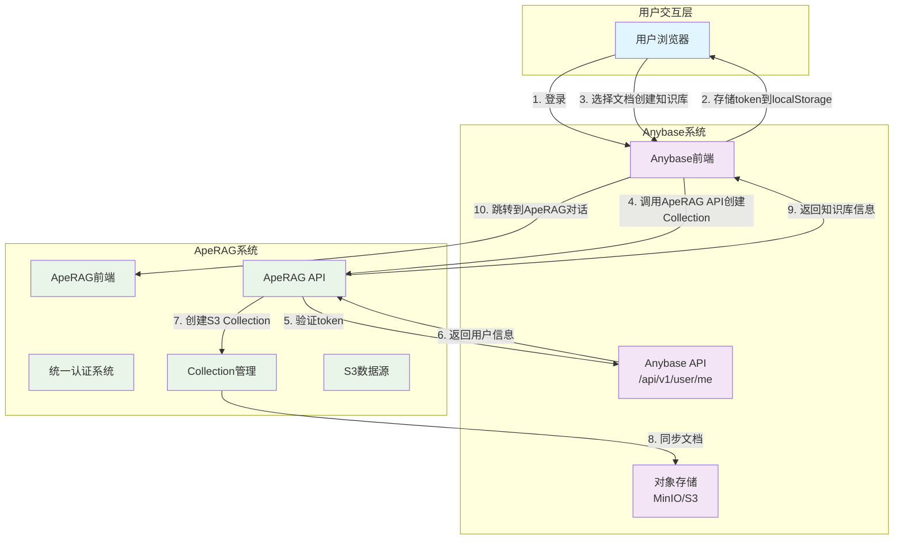
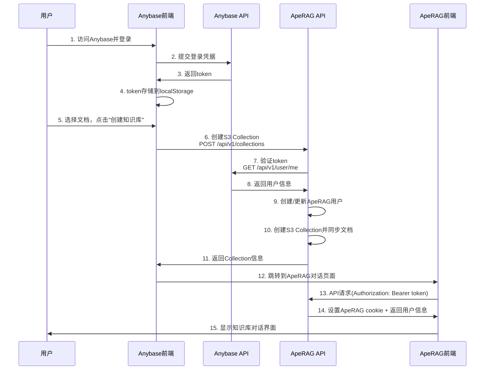
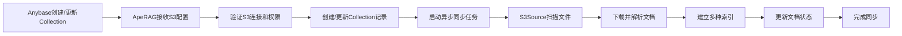

# Anybase集成ApeRAG方案（完整版）

## 概述

本文档描述了Anybase与ApeRAG的完整集成方案，实现用户账户打通、对象存储文档同步和统一登录体验。该方案基于ApeRAG现有的认证系统和对象存储数据源，采用最小化改动的设计原则。

## 集成架构



## 核心功能模块

### 1. 统一认证系统

#### 1.1 认证流程设计



#### 1.2 认证实现

**配置文件 (aperag/config.py)**

```python
class Config(BaseSettings):
    # ... 现有配置 ...
    
    # Anybase Integration
    anybase_enabled: bool = Field(False, alias="ANYBASE_ENABLED")
    anybase_api_base_url: str = Field("", alias="ANYBASE_API_BASE_URL")
    anybase_login_url: str = Field("", alias="ANYBASE_LOGIN_URL")
```

**认证中间件 (aperag/views/auth.py)**

```python
async def current_user(
    request: Request, 
    response: Response,
    session: AsyncSessionDep, 
    user: User = Depends(fastapi_users.current_user(optional=True))
) -> Optional[User]:
    """统一认证入口，支持多种认证方式"""
    # 1. 优先使用ApeRAG Session Cookie
    if user:
        request.state.user_id = user.id
        request.state.username = user.username
        return user
    
    # 2. 尝试Anybase token认证
    anybase_user = await authenticate_anybase_token(request, session)
    if anybase_user:
        request.state.user_id = anybase_user.id
        request.state.username = anybase_user.username
        
        # 自动设置ApeRAG session cookie
        strategy = get_jwt_strategy()
        token = await strategy.write_token(anybase_user)
        response.set_cookie(
            key="session", 
            value=token, 
            max_age=COOKIE_MAX_AGE, 
            httponly=True, 
            samesite="lax"
        )
        
        return anybase_user
    
    # 3. 最后尝试API Key认证
    api_user = await authenticate_api_key(request, session)
    if api_user:
        request.state.user_id = api_user.id
        request.state.username = api_user.username
        return api_user
    
    # 如果启用了Anybase集成，返回重定向信息
    if settings.anybase_enabled and settings.anybase_login_url:
        raise HTTPException(
            status_code=401,
            detail="Unauthorized",
            headers={"X-Anybase-Login-URL": settings.anybase_login_url}
        )
    
    raise HTTPException(status_code=401, detail="Unauthorized")
```

### 2. 对象存储数据源支持

#### 2.1 S3数据源实现

ApeRAG已经实现了完整的S3数据源支持，位于`aperag/source/s3.py`：

```python
class S3Source(Source):
    def __init__(self, ctx: CollectionConfig):
        super().__init__(ctx)
        self.access_key_id = ctx.access_key_id
        self.access_key_secret = ctx.secret_access_key
        self.bucket_name = ctx.bucket
        self.region = ctx.region
        self.dir = ctx.dir
        self.buckets = self._connect_buckets()

    def scan_documents(self) -> Iterator[RemoteDocument]:
        """扫描对象存储中的文档"""
        for bucket_obj in self.bucket_objs:
            bucket_name = bucket_obj["bucket"]
            file_path = bucket_obj["dir"]
            for obj in self.buckets[bucket_name].objects.filter(Prefix=file_path):
                yield RemoteDocument(
                    name=obj.key,
                    size=obj.size,
                    metadata={
                        "modified_time": datetime.utcfromtimestamp(int(obj.last_modified.timestamp())),
                        "bucket_name": bucket_name,
                    },
                )

    def prepare_document(self, name: str, metadata: Dict[str, Any]) -> LocalDocument:
        """下载文档到本地临时文件进行处理"""
        bucket_name = metadata.get("bucket_name", self.bucket_name)
        obj = self.buckets[bucket_name].Object(name)
        content = obj.get()["Body"].read()
        temp_file = gen_temporary_file(name)
        temp_file.write(content)
        temp_file.close()
        return LocalDocument(name=name, path=temp_file.name, metadata=metadata)
```

#### 2.2 Collection配置扩展

Collection模型已支持S3配置，通过`CollectionConfig`和`CollectionSource`：

```python
class CollectionConfig(BaseModel):
    # S3/对象存储配置
    region: Optional[str] = Field(None, description='Region for S3/OSS')
    access_key_id: Optional[str] = Field(None, description='Access key ID for S3/OSS')
    secret_access_key: Optional[str] = Field(None, description='Secret access key for S3/OSS')
    bucket: Optional[str] = Field(None, description='Bucket name for S3/OSS')
    dir: Optional[str] = Field(None, description='Directory path in bucket for S3/OSS')

class CollectionSource(BaseModel):
    category: Optional[Literal['upload', 'tencent', 'oss', 'local', 's3', 'ftp', 'email', 'url', 'github']] = None
    s3: Optional[S3] = None

class S3(BaseModel):
    access_key_id: Optional[str] = None
    access_key_secret: Optional[str] = None
    bucket: Optional[str] = None
    region: Optional[str] = None
    dir: Optional[str] = None
```

### 3. 知识库管理API

#### 3.1 创建对象存储知识库

**API接口**: `POST /api/v1/collections`

**请求示例**:
```http
POST /api/v1/collections
Authorization: Bearer <anybase_token>
Content-Type: application/json

{
  "title": "Anybase文档知识库",
  "description": "从Anybase同步的文档集合",
  "type": "s3",
  "source": {
    "category": "s3",
    "s3": {
      "access_key_id": "your_access_key",
      "access_key_secret": "your_secret_key",
      "bucket": "anybase-documents",
      "region": "us-east-1",
      "dir": "documents/"
    }
  },
  "config": {
    "source": "anybase",
    "access_key_id": "your_access_key",
    "secret_access_key": "your_secret_key",
    "bucket": "anybase-documents",
    "region": "us-east-1",
    "dir": "documents/",
    "enable_knowledge_graph": true,
    "enable_summary": true,
    "enable_vision": false
  }
}
```

**响应示例**:
```json
{
  "id": "col_123456",
  "title": "Anybase文档知识库",
  "type": "s3",
  "description": "从Anybase同步的文档集合",
  "status": "ACTIVE",
  "created": "2025-01-01T00:00:00Z",
  "updated": "2025-01-01T00:00:00Z",
  "config": {
    "source": "anybase",
    "bucket": "anybase-documents",
    "region": "us-east-1",
    "dir": "documents/"
  }
}
```

#### 3.2 查询知识库列表

**API接口**: `GET /api/v1/collections`

**请求示例**:
```http
GET /api/v1/collections
Authorization: Bearer <anybase_token>
```

**响应示例**:
```json
{
  "items": [
    {
      "id": "col_123456",
      "title": "Anybase文档知识库",
      "type": "s3",
      "description": "从Anybase同步的文档集合",
      "status": "ACTIVE",
      "created": "2025-01-01T00:00:00Z",
      "updated": "2025-01-01T00:00:00Z"
    }
  ],
  "pageResult": {
    "page_number": 1,
    "page_size": 20,
    "count": 1
  }
}
```

#### 3.3 更新知识库配置（添加/删除文件）

**API接口**: `PUT /api/v1/collections/{collection_id}`

通过更新Collection的S3配置来实现文件的添加和删除：

**添加文件示例**:
```http
PUT /api/v1/collections/col_123456
Authorization: Bearer <anybase_token>
Content-Type: application/json

{
  "source": {
    "category": "s3",
    "s3": {
      "access_key_id": "your_access_key",
      "access_key_secret": "your_secret_key",
      "bucket": "anybase-documents",
      "region": "us-east-1",
      "dir": "documents/",
      "file_list": [
        "documents/doc1.pdf",
        "documents/doc2.docx",
        "documents/new_doc.txt"
      ]
    }
  }
}
```

**删除文件示例**:
```http
PUT /api/v1/collections/col_123456
Authorization: Bearer <anybase_token>
Content-Type: application/json

{
  "source": {
    "category": "s3",
    "s3": {
      "access_key_id": "your_access_key",
      "access_key_secret": "your_secret_key",
      "bucket": "anybase-documents",
      "region": "us-east-1",
      "dir": "documents/",
      "file_list": [
        "documents/doc1.pdf"
      ]
    }
  }
}
```

#### 3.4 查询知识库文档列表

**API接口**: `GET /api/v1/collections/{collection_id}/documents`

**请求示例**:
```http
GET /api/v1/collections/col_123456/documents
Authorization: Bearer <anybase_token>
```

**响应示例**:
```json
{
  "items": [
    {
      "id": "doc_789",
      "name": "documents/doc1.pdf",
      "status": "COMPLETE",
      "vector_index_status": "ACTIVE",
      "fulltext_index_status": "ACTIVE",
      "graph_index_status": "ACTIVE",
      "summary_index_status": "ACTIVE",
      "size": 1024000,
      "created": "2025-01-01T00:00:00Z",
      "updated": "2025-01-01T00:00:00Z"
    }
  ],
  "pageResult": {
    "page_number": 1,
    "page_size": 20,
    "count": 1
  }
}
```

### 4. 前端集成

#### 4.1 Anybase前端集成

```javascript
// Anybase前端代码
class ApeRAGKnowledgeBaseIntegration {
    constructor(aperagBaseUrl) {
        this.aperagBaseUrl = aperagBaseUrl;
    }
    
    /**
     * 创建知识库
     * @param {Object} s3Config - S3配置信息
     * @param {Array} selectedFiles - 选中的文件列表
     * @param {string} title - 知识库标题
     * @param {string} description - 知识库描述
     */
    async createKnowledgeBase(s3Config, selectedFiles, title, description) {
        const token = localStorage.getItem('token');
        if (!token) {
            throw new Error('请先登录');
        }
        
        const collectionData = {
            title: title || '文档知识库',
            description: description || '从Anybase创建的文档知识库',
            type: 's3',
            source: {
                category: 's3',
                s3: {
                    access_key_id: s3Config.accessKeyId,
                    access_key_secret: s3Config.secretAccessKey,
                    bucket: s3Config.bucket,
                    region: s3Config.region || 'us-east-1',
                    dir: s3Config.dir || '',
                    file_list: selectedFiles
                }
            },
            config: {
                source: 'anybase',
                access_key_id: s3Config.accessKeyId,
                secret_access_key: s3Config.secretAccessKey,
                bucket: s3Config.bucket,
                region: s3Config.region || 'us-east-1',
                dir: s3Config.dir || '',
                enable_knowledge_graph: true,
                enable_summary: true,
                enable_vision: false
            }
        };
        
        try {
            const response = await fetch(`${this.aperagBaseUrl}/api/v1/collections`, {
                method: 'POST',
                headers: {
                    'Content-Type': 'application/json',
                    'Authorization': `Bearer ${token}`
                },
                body: JSON.stringify(collectionData)
            });
            
            if (!response.ok) {
                throw new Error(`创建知识库失败: ${response.statusText}`);
            }
            
            const collection = await response.json();
            return collection;
        } catch (error) {
            console.error('创建知识库失败:', error);
            throw error;
        }
    }
    
    /**
     * 更新知识库文件列表
     * @param {string} collectionId - 知识库ID
     * @param {Object} s3Config - S3配置信息
     * @param {Array} fileList - 新的文件列表
     */
    async updateKnowledgeBaseFiles(collectionId, s3Config, fileList) {
        const token = localStorage.getItem('token');
        if (!token) {
            throw new Error('请先登录');
        }
        
        const updateData = {
            source: {
                category: 's3',
                s3: {
                    ...s3Config,
                    file_list: fileList
                }
            }
        };
        
        try {
            const response = await fetch(`${this.aperagBaseUrl}/api/v1/collections/${collectionId}`, {
                method: 'PUT',
                headers: {
                    'Content-Type': 'application/json',
                    'Authorization': `Bearer ${token}`
                },
                body: JSON.stringify(updateData)
            });
            
            if (!response.ok) {
                throw new Error(`更新知识库失败: ${response.statusText}`);
            }
            
            return await response.json();
        } catch (error) {
            console.error('更新知识库失败:', error);
            throw error;
        }
    }
    
    /**
     * 跳转到知识库对话
     * @param {string} collectionId - 知识库ID
     */
    jumpToChat(collectionId) {
        const token = localStorage.getItem('token');
        if (!token) {
            alert('请先登录');
            return;
        }
        
        // 构建跳转URL
        const params = new URLSearchParams();
        params.set('collection_id', collectionId);
        params.set('anybase_token', token);
        
        const url = `${this.aperagBaseUrl}/chat?${params}`;
        window.open(url, '_blank');
    }
    
    /**
     * 获取知识库列表
     */
    async getKnowledgeBases() {
        const token = localStorage.getItem('token');
        if (!token) {
            throw new Error('请先登录');
        }
        
        try {
            const response = await fetch(`${this.aperagBaseUrl}/api/v1/collections`, {
                headers: {
                    'Authorization': `Bearer ${token}`
                }
            });
            
            if (!response.ok) {
                throw new Error(`获取知识库列表失败: ${response.statusText}`);
            }
            
            return await response.json();
        } catch (error) {
            console.error('获取知识库列表失败:', error);
            throw error;
        }
    }
}

// 使用示例
const aperagIntegration = new ApeRAGKnowledgeBaseIntegration('https://aperag.example.com');

// 创建知识库
document.getElementById('create-kb-btn').addEventListener('click', async () => {
    const selectedFiles = getSelectedDocuments(); // 获取选中的文档
    const s3Config = getS3Config(); // 获取S3配置
    
    try {
        const collection = await aperagIntegration.createKnowledgeBase(
            s3Config,
            selectedFiles,
            '我的文档知识库',
            '包含重要文档的知识库'
        );
        
        console.log('知识库创建成功:', collection);
        
        // 跳转到对话页面
        aperagIntegration.jumpToChat(collection.id);
    } catch (error) {
        alert('创建知识库失败: ' + error.message);
    }
});

// 添加文件到现有知识库
document.getElementById('add-files-btn').addEventListener('click', async () => {
    const collectionId = getCurrentCollectionId();
    const selectedFiles = getSelectedDocuments();
    const s3Config = getS3Config();
    
    try {
        await aperagIntegration.updateKnowledgeBaseFiles(collectionId, s3Config, selectedFiles);
        console.log('文件添加成功');
    } catch (error) {
        alert('添加文件失败: ' + error.message);
    }
});
```

#### 4.2 ApeRAG前端集成

```javascript
// ApeRAG前端代码
class AnybaseAuthHandler {
    constructor() {
        this.setupMessageListener();
        this.checkUrlToken();
    }
    
    checkUrlToken() {
        const urlParams = new URLSearchParams(window.location.search);
        const token = urlParams.get('anybase_token');
        const collectionId = urlParams.get('collection_id');
        
        if (token) {
            this.authenticateWithToken(token, collectionId);
            // 清理URL中的token
            urlParams.delete('anybase_token');
            window.history.replaceState({}, '', `${window.location.pathname}?${urlParams}`);
        }
    }
    
    async authenticateWithToken(token, collectionId) {
        try {
            const response = await fetch('/api/v1/auth/user', {
                headers: {
                    'Authorization': `Bearer ${token}`
                }
            });
            
            if (response.ok) {
                const user = await response.json();
                // 认证成功，ApeRAG cookie已自动设置
                this.onAuthSuccess(user, collectionId);
            } else if (response.status === 401) {
                // 检查是否需要重定向到Anybase登录
                const loginUrl = response.headers.get('X-Anybase-Login-URL');
                if (loginUrl) {
                    window.location.href = loginUrl;
                }
            }
        } catch (error) {
            console.error('Authentication failed:', error);
        }
    }
    
    onAuthSuccess(user, collectionId) {
        // 更新UI状态
        this.updateUserInfo(user);
        
        // 如果有指定的collection，自动加载
        if (collectionId) {
            this.loadCollection(collectionId);
        }
        
        // 初始化应用
        this.initializeApp();
    }
    
    async loadCollection(collectionId) {
        try {
            const response = await fetch(`/api/v1/collections/${collectionId}`);
            if (response.ok) {
                const collection = await response.json();
                // 设置当前知识库
                this.setCurrentCollection(collection);
            }
        } catch (error) {
            console.error('Failed to load collection:', error);
        }
    }
    
    updateUserInfo(user) {
        document.getElementById('user-name').textContent = user.username;
        document.getElementById('user-email').textContent = user.email;
    }
    
    setCurrentCollection(collection) {
        // 更新UI显示当前知识库
        document.getElementById('current-collection').textContent = collection.title;
        // 存储到本地状态
        sessionStorage.setItem('currentCollection', JSON.stringify(collection));
    }
    
    initializeApp() {
        // 初始化ApeRAG应用逻辑
        console.log('ApeRAG initialized with Anybase user');
    }
}

// 页面加载时初始化
document.addEventListener('DOMContentLoaded', () => {
    new AnybaseAuthHandler();
});
```

### 5. 文档同步机制

#### 5.1 同步流程设计



#### 5.2 同步任务实现

ApeRAG的S3Source已经实现了完整的同步机制：

1. **文档扫描**: `scan_documents()` 方法扫描S3存储桶中的文档
2. **文档下载**: `prepare_document()` 方法下载文档到临时文件
3. **索引构建**: 自动构建向量、全文、图谱、摘要等多种索引
4. **增量同步**: 支持基于文件修改时间的增量同步

#### 5.3 文件管理策略

**指定文件列表模式**:
- 通过`file_list`参数指定具体要同步的文件
- 适用于Anybase用户选择特定文档创建知识库的场景
- 支持动态添加和删除文件

**目录扫描模式**:
- 通过`dir`参数指定目录前缀
- 自动扫描目录下的所有文件
- 适用于整个目录同步的场景

## API接口规范

### 1. Anybase提供的接口

#### 用户信息接口

```http
GET /api/v1/user/me
Authorization: Bearer <token>

Response:
{
  "user_id": "u000",
  "nickname": "admin",
  "tenant": "中国美术学院",
  "bucket": "anybase",
  "email": "lora@cca.com",
  "phone": "1234567890",
  "minio_endpoint": "10.0.126.126:9000"
}
```

### 2. ApeRAG提供的接口

#### 用户认证接口

```http
GET /api/v1/auth/user
Authorization: Bearer <anybase_token>

Response:
{
  "id": "user_uuid",
  "username": "u000",
  "email": "lora@cca.com",
  "role": "RO",
  "is_active": true,
  "date_joined": "2025-01-01T00:00:00Z"
}
```

#### 知识库管理接口

**创建知识库**:
```http
POST /api/v1/collections
Authorization: Bearer <anybase_token>
Content-Type: application/json

{
  "title": "知识库标题",
  "description": "知识库描述",
  "type": "s3",
  "source": {
    "category": "s3",
    "s3": {
      "access_key_id": "access_key",
      "access_key_secret": "secret_key",
      "bucket": "bucket_name",
      "region": "us-east-1",
      "dir": "documents/",
      "file_list": ["file1.pdf", "file2.docx"]
    }
  }
}
```

**查询知识库列表**:
```http
GET /api/v1/collections
Authorization: Bearer <anybase_token>
```

**更新知识库**:
```http
PUT /api/v1/collections/{collection_id}
Authorization: Bearer <anybase_token>
Content-Type: application/json

{
  "source": {
    "category": "s3",
    "s3": {
      "file_list": ["file1.pdf", "file3.txt"]
    }
  }
}
```

**查询文档列表**:
```http
GET /api/v1/collections/{collection_id}/documents
Authorization: Bearer <anybase_token>
```

## 配置部署

### 1. 环境变量配置

```bash
# .env文件
# 启用Anybase集成
ANYBASE_ENABLED=true

# Anybase API基础URL（不包含尾部斜杠）
ANYBASE_API_BASE_URL=https://anybase.example.com

# Anybase登录页面URL，用于未认证用户的重定向
ANYBASE_LOGIN_URL=https://anybase.example.com/login
```

### 2. Docker Compose配置

```yaml
version: '3.8'
services:
  aperag-api:
    image: aperag:latest
    environment:
      - ANYBASE_ENABLED=true
      - ANYBASE_API_BASE_URL=https://anybase.example.com
      - ANYBASE_LOGIN_URL=https://anybase.example.com/login
    ports:
      - "8000:8000"
    depends_on:
      - postgres
      - redis
      - qdrant
      - elasticsearch
```

## 使用场景

### 1. 创建知识库场景

1. **用户在Anybase中选择文档**
2. **点击"创建知识库"按钮**
3. **Anybase调用ApeRAG API创建S3 Collection**
4. **ApeRAG自动同步文档并建立索引**
5. **跳转到ApeRAG进行智能对话**

### 2. 管理知识库场景

1. **查看已创建的知识库列表**
2. **向知识库添加新文档**
3. **从知识库删除文档**
4. **查看文档处理状态**

### 3. 智能对话场景

1. **基于知识库内容进行问答**
2. **多路召回：向量、全文、图谱检索**
3. **引用来源文档**
4. **支持多轮对话**

## 安全考虑

### 1. 认证安全

- **Token验证**: 每次请求都实时验证Anybase token有效性
- **权限控制**: Anybase用户默认获得只读权限
- **会话管理**: ApeRAG会话独立于Anybase会话

### 2. 数据安全

- **对象存储访问**: 使用临时凭证和最小权限原则
- **数据隔离**: 不同用户的知识库完全隔离
- **传输加密**: 所有API调用使用HTTPS

### 3. 配置安全

- **敏感信息**: S3凭证等敏感信息加密存储
- **访问控制**: 限制对象存储的访问范围
- **审计日志**: 记录所有操作和访问

## 监控和运维

### 1. 关键指标

- **知识库创建成功率**
- **文档同步成功率**
- **索引构建时间**
- **API响应时间**

### 2. 日志监控

```python
# 关键日志示例
logger.info(f"Created S3 collection {collection_id} for Anybase user {user_id}")
logger.info(f"Synced {doc_count} documents from S3 bucket {bucket_name}")
logger.error(f"Failed to sync S3 collection {collection_id}: {error}")
```

### 3. 告警配置

- **S3连接失败**: 连续失败时告警
- **文档同步失败**: 批量失败时告警
- **索引构建失败**: 失败率过高时告警

## 总结

该集成方案具有以下优势：

1. **完整的对象存储支持**: 基于现有S3Source实现，支持多种对象存储
2. **灵活的文件管理**: 支持指定文件列表和目录扫描两种模式
3. **自动化同步**: 文档变更自动同步，索引自动构建
4. **统一的用户体验**: 从文档选择到智能对话的完整流程
5. **企业级安全**: 完善的权限控制和数据隔离机制

通过该方案，用户可以在Anybase中轻松创建和管理知识库，实现文档的智能化利用和知识的高效检索。
