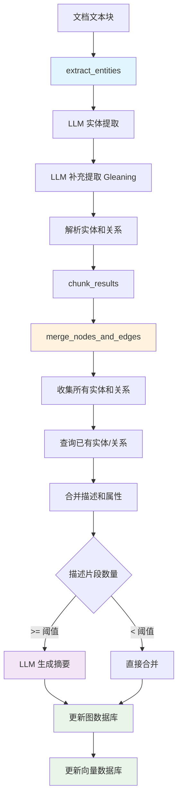

# LightRAG 实体提取与合并机制详解

## 1. 概述

本文档详细介绍 LightRAG 系统中两个核心函数的工作原理：
- `extract_entities`: 从文本块中提取实体和关系
- `merge_nodes_and_edges`: 合并提取结果并更新知识图谱

这两个函数构成了 LightRAG 知识图谱构建的核心流程，负责将非结构化文本转换为结构化的知识图谱。

---

## 2. extract_entities 函数详解

### 2.1 函数概述

`extract_entities` 是 LightRAG 的实体提取引擎，负责从文档的文本块（chunks）中识别和提取实体（entities）及其关系（relationships）。

### 2.2 输入参数

```python
async def extract_entities(
    chunks: dict[str, TextChunkSchema],           # 文本块字典
    use_llm_func: callable,                      # LLM 调用函数
    entity_extract_max_gleaning: int,            # 最大补充提取轮数
    addon_params: dict,                          # 附加参数（语言、实体类型等）
    llm_model_max_async: int,                    # 最大并发数
    lightrag_logger: LightRAGLogger | None,     # 日志记录器
) -> list:                                       # 返回提取结果列表
```

### 2.3 工作流程

#### 阶段1：提示词准备
```python
# 1. 配置语言和实体类型
language = addon_params.get("language", PROMPTS["DEFAULT_LANGUAGE"])
entity_types = addon_params.get("entity_types", PROMPTS["DEFAULT_ENTITY_TYPES"])

# 2. 构建示例和上下文
examples = "\n".join(PROMPTS["entity_extraction_examples"])
context_base = dict(
    tuple_delimiter=PROMPTS["DEFAULT_TUPLE_DELIMITER"],      # 元组分隔符
    record_delimiter=PROMPTS["DEFAULT_RECORD_DELIMITER"],    # 记录分隔符
    completion_delimiter=PROMPTS["DEFAULT_COMPLETION_DELIMITER"], # 完成分隔符
    entity_types=",".join(entity_types),
    examples=examples,
    language=language,
)
```

#### 阶段2：并发处理文本块
```python
# 使用信号量控制并发数
semaphore = asyncio.Semaphore(llm_model_max_async)

# 为每个文本块创建异步任务
tasks = []
for chunk in ordered_chunks:
    task = asyncio.create_task(_process_with_semaphore(chunk))
    tasks.append(task)

# 等待所有任务完成，支持异常处理
done, pending = await asyncio.wait(tasks, return_when=asyncio.FIRST_EXCEPTION)
```

#### 阶段3：单个文本块处理 (`_process_single_content`)

**步骤1：初始提取**
```python
# 构建提取提示词
hint_prompt = entity_extract_prompt.format(**{**context_base, "input_text": content})

# 调用 LLM 进行初始提取
final_result = await use_llm_func(hint_prompt)

# 解析提取结果
maybe_nodes, maybe_edges = await _process_extraction_result(final_result, chunk_key, file_path)
```

**步骤2：补充提取（Gleaning）**
```python
for now_glean_index in range(entity_extract_max_gleaning):
    # 使用继续提取提示词
    glean_result = await use_llm_func(continue_prompt, history_messages=history)
    
    # 解析补充结果（只接受新的实体名称）
    glean_nodes, glean_edges = await _process_extraction_result(glean_result, chunk_key, file_path)
    
    # 合并结果（去重）
    for entity_name, entities in glean_nodes.items():
        if entity_name not in maybe_nodes:  # 只接受新实体名称
            maybe_nodes[entity_name].extend(entities)
    
    # 判断是否继续提取
    if_loop_result = await use_llm_func(if_loop_prompt, history_messages=history)
    if if_loop_result.strip().lower() != "yes":
        break
```

### 2.4 提取结果解析

#### 实体解析 (`_handle_single_entity_extraction`)
```python
# 输入格式: ("entity", "实体名称", "实体类型", "实体描述")
def _handle_single_entity_extraction(record_attributes, chunk_key, file_path):
    entity_name = clean_str(record_attributes[1]).strip()
    entity_type = clean_str(record_attributes[2]).strip('"')
    entity_description = clean_str(record_attributes[3])
    
    # 标准化实体名称
    entity_name = normalize_extracted_info(entity_name, is_entity=True)
    entity_description = normalize_extracted_info(entity_description)
    
    return dict(
        entity_name=entity_name,
        entity_type=entity_type,
        description=entity_description,
        source_id=chunk_key,
        file_path=file_path,
    )
```

#### 关系解析 (`_handle_single_relationship_extraction`)
```python
# 输入格式: ("relationship", "源实体", "目标实体", "关系描述", "关键词", "权重")
def _handle_single_relationship_extraction(record_attributes, chunk_key, file_path):
    source = normalize_extracted_info(clean_str(record_attributes[1]), is_entity=True)
    target = normalize_extracted_info(clean_str(record_attributes[2]), is_entity=True)
    edge_description = normalize_extracted_info(clean_str(record_attributes[3]))
    edge_keywords = normalize_extracted_info(clean_str(record_attributes[4]), is_entity=True)
    weight = float(record_attributes[-1]) if is_float_regex(record_attributes[-1]) else 1.0
    
    return dict(
        src_id=source,
        tgt_id=target,
        weight=weight,
        description=edge_description,
        keywords=edge_keywords,
        source_id=chunk_key,
        file_path=file_path,
    )
```

### 2.5 输出格式

```python
# 返回格式：每个文本块的提取结果
chunk_results = [
    (maybe_nodes, maybe_edges),  # 每个元素对应一个文本块
    # maybe_nodes: {entity_name: [entity_data1, entity_data2, ...]}
    # maybe_edges: {(src_id, tgt_id): [edge_data1, edge_data2, ...]}
]
```

### 2.6 重要澄清：chunk_results 的真实结构

**关键理解**：`chunk_results` **不是**整个文档合并后的结果，而是**每个文本块（chunk）独立提取结果的列表**。

#### 详细结构说明

```python
# 假设一个文档被分成3个文本块
document = "苹果公司的iPhone很受欢迎。蒂姆·库克是苹果的CEO。苹果股价上涨了。"

# 分块处理：
# chunk1: "苹果公司的iPhone很受欢迎。"
# chunk2: "蒂姆·库克是苹果的CEO。"
# chunk3: "苹果股价上涨了。"

# extract_entities 的实际输出结构：
chunk_results = [
    # chunk1 的独立提取结果
    (
        {
            "苹果公司": [{"entity_name": "苹果公司", "entity_type": "ORGANIZATION", ...}],
            "iPhone": [{"entity_name": "iPhone", "entity_type": "PRODUCT", ...}]
        },
        {
            ("苹果公司", "iPhone"): [{"src_id": "苹果公司", "tgt_id": "iPhone", ...}]
        }
    ),
    
    # chunk2 的独立提取结果
    (
        {
            "蒂姆·库克": [{"entity_name": "蒂姆·库克", "entity_type": "PERSON", ...}],
            "苹果公司": [{"entity_name": "苹果公司", "entity_type": "ORGANIZATION", ...}]  # 重复出现！
        },
        {
            ("蒂姆·库克", "苹果公司"): [{"src_id": "蒂姆·库克", "tgt_id": "苹果公司", ...}]
        }
    ),
    
    # chunk3 的独立提取结果
    (
        {
            "苹果公司": [{"entity_name": "苹果公司", "entity_type": "ORGANIZATION", ...}]  # 再次重复！
        },
        {}  # 这个chunk没有提取到关系
    )
]
```

#### 为什么采用这种设计？

1. **并发处理效率**：每个文本块可以独立并发处理，提高整体效率
2. **内存管理**：避免在内存中构建巨大的中间合并结果
3. **错误隔离**：单个文本块处理失败不影响其他块
4. **处理灵活性**：可以对不同文本块应用不同的处理策略

#### 性能影响分析

这种设计意味着：
- **同一实体会在多个chunk中重复出现**（如上例中的"苹果公司"出现3次）
- **merge_nodes_and_edges 需要处理大量重复数据**
- **锁的持有时间更长**，因为需要合并所有chunk的结果

---

## 3. merge_nodes_and_edges 函数详解

### 3.1 函数概述

`merge_nodes_and_edges` 负责将 `extract_entities` 的**原始提取结果**进行合并去重，处理跨文本块的重复实体和关系，并更新知识图谱数据库。

**重要提醒**：输入的 `chunk_results` 包含大量重复数据，合并工作是这个函数的核心任务。

### 3.2 输入参数

```python
async def merge_nodes_and_edges(
    chunk_results: list,                         # extract_entities 的输出结果
    knowledge_graph_inst: BaseGraphStorage,     # 图数据库实例
    entity_vdb: BaseVectorStorage,              # 实体向量数据库
    relationships_vdb: BaseVectorStorage,       # 关系向量数据库
    llm_model_func,                             # LLM 函数（用于摘要生成）
    tokenizer,                                  # 分词器
    llm_model_max_token_size,                   # LLM 最大 token 数
    summary_to_max_tokens,                      # 摘要最大 token 数
    addon_params,                               # 附加参数
    force_llm_summary_on_merge,                 # 强制 LLM 摘要的阈值
    # ... 其他参数
) -> None:
```

### 3.3 工作流程

#### 阶段1：数据收集和预处理

**关键步骤：跨chunk合并同名实体和关系**

```python
# 收集所有实体和关系（这是真正的"合并"工作）
all_nodes = defaultdict(list)
all_edges = defaultdict(list)

for maybe_nodes, maybe_edges in chunk_results:  # 遍历每个chunk的独立结果
    # 收集实体：同名实体会被合并到同一个列表中
    for entity_name, entities in maybe_nodes.items():
        all_nodes[entity_name].extend(entities)  # 关键：合并同名实体
    
    # 收集关系：使用排序的键确保一致性
    for edge_key, edges in maybe_edges.items():
        sorted_edge_key = tuple(sorted(edge_key))  # (A,B) 和 (B,A) 统一为 (A,B)
        all_edges[sorted_edge_key].extend(edges)   # 关键：合并同样的关系

# 合并后的结果示例：
# all_nodes["苹果公司"] = [entity1_from_chunk1, entity4_from_chunk2, entity5_from_chunk3]
# all_nodes["iPhone"] = [entity2_from_chunk1]
# all_nodes["蒂姆·库克"] = [entity3_from_chunk2]
```

**性能关键点**：
- 此时 `all_nodes["苹果公司"]` 包含来自3个不同chunk的实体数据
- 每个实体的合并都需要查询数据库、调用LLM生成摘要、计算向量
- 所有这些操作都在同一个锁内完成

#### 阶段2：实体合并处理 (`_merge_nodes_then_upsert`)

**步骤1：获取已有实体数据**
```python
already_node = await knowledge_graph_inst.get_node(entity_name)
if already_node:
    already_entity_types.append(already_node["entity_type"])
    already_source_ids.extend(split_string_by_multi_markers(already_node["source_id"], [GRAPH_FIELD_SEP]))
    already_description.append(already_node["description"])
```

**步骤2：合并实体属性**
```python
# 选择最常见的实体类型
entity_type = sorted(
    Counter([dp["entity_type"] for dp in nodes_data] + already_entity_types).items(),
    key=lambda x: x[1], reverse=True
)[0][0]

# 合并描述（使用分隔符连接，去重并排序）
description = GRAPH_FIELD_SEP.join(sorted(set([dp["description"] for dp in nodes_data] + already_description)))

# 合并来源信息
source_id = GRAPH_FIELD_SEP.join(set([dp["source_id"] for dp in nodes_data] + already_source_ids))
```

**步骤3：智能摘要生成**
```python
num_fragment = description.count(GRAPH_FIELD_SEP) + 1

if num_fragment >= force_llm_summary_on_merge:
    # 描述片段过多时，使用 LLM 生成摘要
    description = await _handle_entity_relation_summary(
        entity_name,
        description,
        llm_model_func,
        tokenizer,
        llm_model_max_token_size,
        summary_to_max_tokens,
        language,
        lightrag_logger,
    )
```

#### 阶段3：关系合并处理 (`_merge_edges_then_upsert`)

**步骤1：获取已有关系数据**
```python
if await knowledge_graph_inst.has_edge(src_id, tgt_id):
    already_edge = await knowledge_graph_inst.get_edge(src_id, tgt_id)
    if already_edge:
        already_weights.append(already_edge.get("weight", 0.0))
        already_description.append(already_edge["description"])
        # ... 其他字段处理
```

**步骤2：合并关系属性**
```python
# 权重累加
weight = sum([dp["weight"] for dp in edges_data] + already_weights)

# 描述合并
description = GRAPH_FIELD_SEP.join(
    sorted(set([dp["description"] for dp in edges_data] + already_description))
)

# 关键词去重合并
all_keywords = set()
for edge in edges_data:
    if edge.get("keywords"):
        all_keywords.update(k.strip() for k in edge["keywords"].split(",") if k.strip())
keywords = ",".join(sorted(all_keywords))
```

**步骤3：确保关系端点存在**
```python
# 如果关系的源实体或目标实体不存在，创建 UNKNOWN 类型的实体
for need_insert_id in [src_id, tgt_id]:
    if not (await knowledge_graph_inst.has_node(need_insert_id)):
        await knowledge_graph_inst.upsert_node(need_insert_id, node_data={
            "entity_id": need_insert_id,
            "entity_type": "UNKNOWN",
            "description": description,
            # ... 其他字段
        })
```

#### 阶段4：向量数据库更新

**实体向量化**
```python
if entity_vdb is not None and entities_data:
    data_for_vdb = {
        compute_mdhash_id(dp["entity_name"], prefix="ent-"): {
            "entity_name": dp["entity_name"],
            "entity_type": dp["entity_type"],
            "content": f"{dp['entity_name']}\n{dp['description']}",  # 实体名称+描述作为向量内容
            "source_id": dp["source_id"],
            "file_path": dp.get("file_path", "unknown_source"),
        }
        for dp in entities_data
    }
    await entity_vdb.upsert(data_for_vdb)
```

**关系向量化**
```python
if relationships_vdb is not None and relationships_data:
    data_for_vdb = {
        compute_mdhash_id(dp["src_id"] + dp["tgt_id"], prefix="rel-"): {
            "src_id": dp["src_id"],
            "tgt_id": dp["tgt_id"],
            "keywords": dp["keywords"],
            "content": f"{dp['src_id']}\t{dp['tgt_id']}\n{dp['keywords']}\n{dp['description']}",  # 关系三元组格式
            "source_id": dp["source_id"],
            "file_path": dp.get("file_path", "unknown_source"),
        }
        for dp in relationships_data
    }
    await relationships_vdb.upsert(data_for_vdb)
```

---

## 4. 数据流转图



---

## 5. 关键设计特性

### 5.1 增量更新机制

- **描述累积**：使用 `GRAPH_FIELD_SEP` 分隔符累积所有描述，不覆盖历史信息
- **去重排序**：通过 `set()` 去重和 `sorted()` 排序确保一致性
- **权重累加**：关系权重采用累加方式，反映关系强度

### 5.2 智能摘要策略

- **阈值控制**：当描述片段数量达到 `force_llm_summary_on_merge` 时触发 LLM 摘要
- **性能平衡**：避免对每个微小更新都调用 LLM，提高处理效率
- **信息保全**：在摘要过程中尽可能保留关键信息

### 5.3 并发安全设计

- **锁机制**：通过 `graph_db_lock` 确保合并操作的原子性
- **事务处理**：将读取-合并-写入作为一个完整的事务处理
- **一致性保证**：防止并发更新导致的数据不一致

### 5.4 错误处理和容错

- **异常传播**：在并发处理中，任何任务失败都会取消其他待处理任务
- **数据验证**：对提取结果进行严格的格式和内容验证
- **缺失处理**：自动创建缺失的实体节点，确保关系完整性

---

## 6. 性能特征

### 6.1 时间复杂度

- **extract_entities**: O(n × m)，其中 n 是文本块数量，m 是每个块的 LLM 调用次数
- **merge_nodes_and_edges**: O(e + r)，其中 e 是实体数量，r 是关系数量

### 6.2 并发特性

- **extract_entities**: 高度并行，受 `llm_model_max_async` 限制
- **merge_nodes_and_edges**: 串行处理（受锁保护），但内部操作高效

### 6.3 资源消耗

- **内存使用**：主要消耗在存储提取结果和合并数据
- **网络I/O**：LLM 调用和数据库操作是主要瓶颈
- **计算资源**：文本处理和向量计算占用适中

---

## 7. 总结

`extract_entities` 和 `merge_nodes_and_edges` 构成了 LightRAG 知识图谱构建的核心引擎：

1. **extract_entities** 负责从原始文本中智能提取结构化信息，采用多轮提取和并发处理提高效率和准确性
2. **merge_nodes_and_edges** 负责将提取结果整合到知识图谱中，通过增量更新和智能摘要保证数据质量和一致性

两个函数的协同工作实现了从非结构化文本到结构化知识图谱的高效转换，为后续的知识查询和推理奠定了坚实基础。 