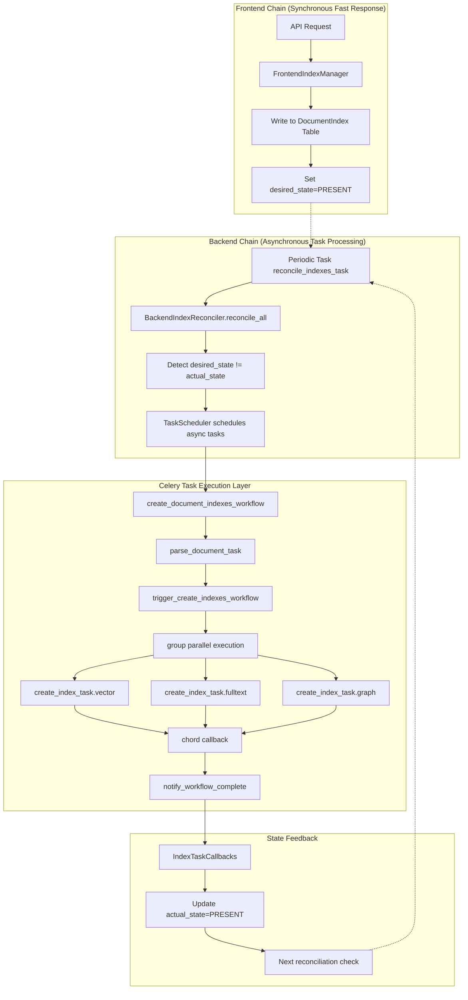

# ApeRAG Indexing Pipeline Architecture Design

## Overview

ApeRAG's indexing pipeline architecture adopts a dual-chain design pattern, separating index management into Frontend Chain and Backend Chain, implementing asynchronous document indexing through state-driven reconciliation. The frontend chain handles fast user operation responses and sets desired index states, while the backend chain detects state differences through a periodic reconciler and schedules asynchronous tasks to execute actual indexing operations.

## Architecture Overview



## Core Design Principles

### 1. Dual Chain Separation

**Frontend Chain**：
- **Goal**: Fast response to user operations without blocking API requests
- **Implementation**: Only operates on database tables, sets desired state, returns immediately
- **Code**: `FrontendIndexManager` in `aperag/index/manager.py`

**Backend Chain**：
- **Goal**: Asynchronously execute time-consuming indexing operations with retry and error recovery support
- **Implementation**: Continuously scans state differences through periodic tasks and schedules async tasks
- **Code**: `BackendIndexReconciler` in `aperag/index/reconciler.py`

### 2. State-Driven Reconciliation

Records desired and actual states for each document index through the `DocumentIndex` database table:

```python
class DocumentIndex(BaseModel):
    document_id: str
    index_type: DocumentIndexType  # vector/fulltext/graph
    desired_state: IndexDesiredState  # PRESENT/ABSENT
    actual_state: IndexActualState    # ABSENT/CREATING/PRESENT/DELETING/FAILED
    version: int                     # Version number, increment to trigger rebuild
```

The reconciler periodically scans all records and triggers corresponding operations when `desired_state != actual_state`.

### 3. TaskScheduler Abstraction Layer Design

**Design Advantages**：
- **Business Logic and Task System Decoupling**: Reconciler only cares about "what operations to execute", not "what system to execute with"
- **Multi-scheduler Support**: Can switch between Celery, local synchronous, Prefect/Airflow and other workflow engines
- **Test-friendly**: Can use LocalTaskScheduler for synchronous execution during testing, facilitating debugging

```python
# Abstract interface
class TaskScheduler(ABC):
    def schedule_create_index(self, document_id: str, index_types: List[str]) -> str
    def schedule_update_index(self, document_id: str, index_types: List[str]) -> str  
    def schedule_delete_index(self, document_id: str, index_types: List[str]) -> str

# Reconciler uses abstract interface
class BackendIndexReconciler:
    def __init__(self, scheduler_type: str = "celery"):
        self.task_scheduler = create_task_scheduler(scheduler_type)
    
    def _reconcile_document_operations(self, document_id: str, operations: dict):
        if create_index_types:
            # Only calls abstract interface, doesn't care about specific implementation
            self.task_scheduler.schedule_create_index(document_id, create_index_types)
```

**Celery Task Entry Point and Business Code Separation**：
- Celery task functions (`config/celery_tasks.py`): Handle task scheduling, parameter serialization, error retry
- Business logic (`aperag/tasks/document.py`): Handle specific index creation logic
- This separation enables independent testing of business logic and facilitates migration between different task systems

## Asynchronous Task System

### Current Asynchronous Task List

ApeRAG currently defines the following asynchronous tasks, each with clear responsibility division:

| Task Name | Function | Retry Count | Location |
|-----------|----------|-------------|----------|
| `parse_document_task` | Parse document content, extract text and metadata | 3 times | config/celery_tasks.py |
| `create_index_task` | Create single type index (vector/fulltext/graph) | 3 times | config/celery_tasks.py |
| `update_index_task` | Update single type index | 3 times | config/celery_tasks.py |
| `delete_index_task` | Delete single type index | 3 times | config/celery_tasks.py |
| `trigger_create_indexes_workflow` | Dynamic fan-out for index creation tasks | No retry | config/celery_tasks.py |
| `trigger_update_indexes_workflow` | Dynamic fan-out for index update tasks | No retry | config/celery_tasks.py |
| `trigger_delete_indexes_workflow` | Dynamic fan-out for index deletion tasks | No retry | config/celery_tasks.py |
| `notify_workflow_complete` | Aggregate workflow results and notify completion | No retry | config/celery_tasks.py |
| `reconcile_indexes_task` | Periodic reconciler task | No retry | config/celery_tasks.py |

### Task Design Principles

1. **Fine-grained Tasks**: Each index type (vector/fulltext/graph) is an independent task, supporting individual retries
2. **Dynamic Orchestration**: Use trigger tasks to decide which index tasks to execute at runtime
3. **Layered Retry**: Business tasks support retry, orchestration tasks don't retry
4. **State Callbacks**: Each task calls back to update database state upon completion

### Concurrent Execution Design

#### Celery Group + Chord Pattern

Use Celery's `group` for parallel execution and `chord` for result aggregation:

```python
# Group: Execute multiple index tasks in parallel
parallel_index_tasks = group([
    create_index_task.s(document_id, "vector", parsed_data_dict),
    create_index_task.s(document_id, "fulltext", parsed_data_dict),
    create_index_task.s(document_id, "graph", parsed_data_dict)
])

# Chord: Execute callback after all parallel tasks complete
workflow_chord = chord(
    parallel_index_tasks,
    notify_workflow_complete.s(document_id, "create", ["vector", "fulltext", "graph"])
)
```

#### Task Chaining Mechanism

Use Celery's `chain` for task chaining and `signature` for parameter passing:

```python
# Chained execution: parse -> dynamic fan-out
workflow_chain = chain(
    parse_document_task.s(document_id),  # First task
    trigger_create_indexes_workflow.s(document_id, index_types)  # Second task, receives first task's result
)

# Signature mechanism for parameter passing
# parse_document_task's return value becomes the first parameter of trigger_create_indexes_workflow
```

#### Parameter Passing and Data Flow

```python
# Data flow:
# 1. parse_document_task returns ParsedDocumentData.to_dict()
# 2. trigger_create_indexes_workflow receives parsing result
# 3. Dynamically creates parallel tasks, each task receives complete parsing data
# 4. notify_workflow_complete aggregates all index task results

def trigger_create_indexes_workflow(self, parsed_data_dict: dict, document_id: str, index_types: List[str]):
    # parsed_data_dict is the previous task's return value
    parallel_index_tasks = group([
        # Each parallel task can access complete parsing data
        create_index_task.s(document_id, index_type, parsed_data_dict)
        for index_type in index_types
    ])
```

## Specific Execution Flow Examples

### Index Creation Execution Flow

Taking user document upload triggering index creation as example:

```python
# 1. Frontend Chain (Synchronous, millisecond-level)
API Call -> FrontendIndexManager.create_document_indexes()
    ↓
Write DocumentIndex table records:
{
    document_id: "doc123",
    index_type: "vector", 
    desired_state: "PRESENT",
    actual_state: "ABSENT",
    version: 1
}
    ↓ 
API returns 200 immediately

# 2. Backend Chain (Asynchronous, minute-level)
Periodic task reconcile_indexes_task (executes every 30 seconds) 
    ↓
BackendIndexReconciler.reconcile_all()
    ↓
Detects desired_state=PRESENT, actual_state=ABSENT
    ↓
CeleryTaskScheduler.schedule_create_index(doc123, ["vector", "fulltext", "graph"])
    ↓
create_document_indexes_workflow.delay()

# 3. Celery Task Execution (Asynchronous, minutes to hours)
parse_document_task("doc123")
├── Download document file to local temp directory
├── Call docparser to parse document content  
├── Return ParsedDocumentData.to_dict()
└── Update actual_state="CREATING"
    ↓
trigger_create_indexes_workflow(parsed_data, "doc123", ["vector", "fulltext", "graph"])
├── Create group parallel tasks
└── Start chord waiting
    ↓
Parallel execution:
├── create_index_task("doc123", "vector", parsed_data)
│   ├── Call vector_indexer.create_index()
│   ├── Generate embeddings and store in vector database
│   └── Callback IndexTaskCallbacks.on_index_created()
├── create_index_task("doc123", "fulltext", parsed_data)  
│   ├── Call fulltext_indexer.create_index()
│   ├── Build full-text search index
│   └── Callback IndexTaskCallbacks.on_index_created()
└── create_index_task("doc123", "graph", parsed_data)
    ├── Call graph_indexer.create_index()
    ├── Build knowledge graph
    └── Callback IndexTaskCallbacks.on_index_created()
    ↓
notify_workflow_complete([result1, result2, result3], "doc123", "create", ["vector", "fulltext", "graph"])
├── Aggregate all index task results
├── Log workflow completion
└── Return WorkflowResult
```

### Index Update Execution Flow

User modifies document content triggering index update:

```python
# 1. Frontend Chain
API Call -> FrontendIndexManager.update_document_indexes()
    ↓
All existing index records version field +1:
version: 1 -> 2 (triggers rebuild)
    ↓
API returns immediately

# 2. Backend Chain
reconcile_indexes_task detects version mismatch
    ↓
actual_state=PRESENT but version outdated, determined as needing update
    ↓
schedule_update_index() -> update_document_indexes_workflow()

# 3. Task Execution (similar to creation)
parse_document_task -> trigger_update_indexes_workflow -> parallel update_index_task
```

### Index Deletion Execution Flow

User deletes document triggering index deletion:

```python
# 1. Frontend Chain  
API Call -> FrontendIndexManager.delete_document_indexes()
    ↓
Set desired_state="ABSENT"
    ↓
API returns immediately

# 2. Backend Chain
Detects desired_state=ABSENT, actual_state=PRESENT
    ↓
schedule_delete_index() -> delete_document_indexes_workflow()

# 3. Task Execution (no parsing needed)
trigger_delete_indexes_workflow -> parallel delete_index_task
├── Delete embeddings from vector database
├── Delete documents from full-text search engine
└── Delete nodes and relationships from knowledge graph
```

## Exception Handling Mechanism

### Task-level Exception Handling

Each Celery task is configured with automatic retry:

```python
@current_app.task(bind=True, autoretry_for=(Exception,), retry_kwargs={'max_retries': 3, 'countdown': 60})
def create_index_task(self, document_id: str, index_type: str, parsed_data_dict: dict):
    try:
        # Business logic
        result = document_index_task.create_index(document_id, index_type, parsed_data)
        if result.success:
            self._handle_index_success(document_id, index_type, result.data)
        else:
            # Business logic failure but don't throw exception to avoid meaningless retry
            if self.request.retries >= self.max_retries:
                self._handle_index_failure(document_id, [index_type], result.error)
        return result.to_dict()
    except Exception as e:
        # Only mark as failed after retry attempts are exhausted
        if self.request.retries >= self.max_retries:
            self._handle_index_failure(document_id, [index_type], str(e))
        raise  # Continue throwing exception to trigger retry
```

### Workflow-level Exception Handling

Aggregate errors through `notify_workflow_complete`:

```python
def notify_workflow_complete(self, index_results: List[dict], document_id: str, operation: str, index_types: List[str]):
    successful_tasks = []
    failed_tasks = []
    
    for result_dict in index_results:
        result = IndexTaskResult.from_dict(result_dict)
        if result.success:
            successful_tasks.append(result.index_type)
        else:
            failed_tasks.append(f"{result.index_type}: {result.error}")
    
    # Determine overall status
    if not failed_tasks:
        status = TaskStatus.SUCCESS  # All successful
    elif successful_tasks:
        status = TaskStatus.PARTIAL_SUCCESS  # Partial success
    else:
        status = TaskStatus.FAILED  # All failed
```

### State Management and Error Recovery

Track errors through database state:

```python
class IndexTaskCallbacks:
    @staticmethod
    def on_index_failed(document_id: str, index_type: str, error_message: str):
        """Task failure callback"""
        # Update database state
        doc_index.actual_state = IndexActualState.FAILED
        doc_index.error_message = error_message
        
        # Will retry on next reconcile
```

### Error Recovery Strategies

1. **Automatic Retry**: Task-level 3 automatic retries to handle temporary network or resource issues
2. **State Reset**: Users can manually reset failed state to trigger re-execution
3. **Partial Retry**: Only retry failed index types without affecting successful indexes
4. **Degraded Handling**: Some index failures don't affect document searchability (e.g., graph index failure but vector index success)

### Monitoring and Alerting

- **Task Execution Logs**: Each task records detailed execution logs
- **Failure Rate Statistics**: View task failure rates through Celery monitoring tools  
- **State Inconsistency Detection**: Periodically check tasks in CREATING state for extended periods
- **Resource Usage Monitoring**: Monitor memory and CPU usage during task execution

## Code Organization Structure

### Directory Structure

```
aperag/
├── index/                    # Index management core module
│   ├── manager.py           # Frontend index manager
│   ├── reconciler.py        # Backend reconciler
│   ├── base.py             # Indexer base class definition
│   ├── vector_index.py     # Vector index implementation
│   ├── fulltext_index.py   # Full-text index implementation
│   └── graph_index.py      # Graph index implementation
├── tasks/                   # Task-related modules
│   ├── models.py           # Task data structure definitions
│   ├── scheduler.py        # Task scheduler abstraction layer
│   ├── document.py         # Document processing business logic
│   └── utils.py            # Task utility functions
└── db/
    └── models.py           # Database model definitions

config/
└── celery_tasks.py         # Celery task definitions
```

### Core Interface Design

#### Frontend Management Interface
```python
# aperag/index/manager.py
class FrontendIndexManager:
    async def create_document_indexes(self, session, document_id, user, index_types)
    async def update_document_indexes(self, session, document_id) 
    async def delete_document_indexes(self, session, document_id, index_types)
    async def get_document_index_status(self, session, document_id)
```

#### Reconciler Interface
```python
# aperag/index/reconciler.py
class BackendIndexReconciler:
    def reconcile_all(self)  # Main reconciliation loop
    def _get_indexes_needing_reconciliation(self, session)  # Get indexes needing reconciliation
    def _reconcile_grouped(self, indexes_needing_reconciliation)  # Batch reconciliation processing
```

#### Indexer Interface
```python
# aperag/index/base.py
class BaseIndexer(ABC):
    def create_index(self, document_id, content, doc_parts, collection, **kwargs)
    def update_index(self, document_id, content, doc_parts, collection, **kwargs)
    def delete_index(self, document_id, collection, **kwargs)
    def is_enabled(self, collection)
```

### Data Flow Design

#### Task Data Structures
```python
# aperag/tasks/models.py
@dataclass
class ParsedDocumentData:
    """Document parsing result, carries data needed by all index tasks"""
    document_id: str
    collection_id: str
    content: str              # Parsed text content
    doc_parts: List[Any]      # Chunked document segments
    file_path: str           # Local file path
    local_doc_info: LocalDocumentInfo  # Temporary file information

@dataclass 
class IndexTaskResult:
    """Single index task execution result"""
    status: TaskStatus
    index_type: str
    document_id: str
    success: bool
    data: Optional[Dict[str, Any]]    # Index metadata (e.g., vector count)
    error: Optional[str]

@dataclass
class WorkflowResult:
    """Entire workflow execution result"""
    workflow_id: str
    document_id: str
    operation: str            # create/update/delete
    status: TaskStatus
    successful_indexes: List[str]
    failed_indexes: List[str]
    index_results: List[IndexTaskResult]
```

## Summary

ApeRAG's indexing pipeline architecture achieves efficient document indexing through the following technical design:

### Core Advantages

1. **Fast Response**: Frontend chain only operates on database, API response time controlled at millisecond level
2. **Strong Processing Capability**: Backend asynchronous processing supports large-scale document indexing, improving throughput through parallel tasks
3. **Good Error Recovery**: Multi-level retry mechanisms and state management, supporting graceful handling of partial failure scenarios
4. **Strong System Decoupling**: TaskScheduler abstraction layer decouples business logic from specific task systems
5. **Comprehensive Monitoring**: Full-chain state tracking and logging for easy troubleshooting and performance optimization

### Technical Features

1. **State-driven**: Achieves eventual consistency through detection of differences between desired and actual states
2. **Dynamic Orchestration**: Dynamically creates index tasks at runtime based on document parsing results, avoiding static workflow limitations
3. **Batch Optimization**: Multiple index tasks for the same document share parsing results, reducing redundant computation
4. **Layered Design**: Task scheduling, business logic, and index implementation are decoupled in layers for easy testing and maintenance

This architecture provides good performance and scalability support for high-concurrency document indexing scenarios while ensuring system reliability. 