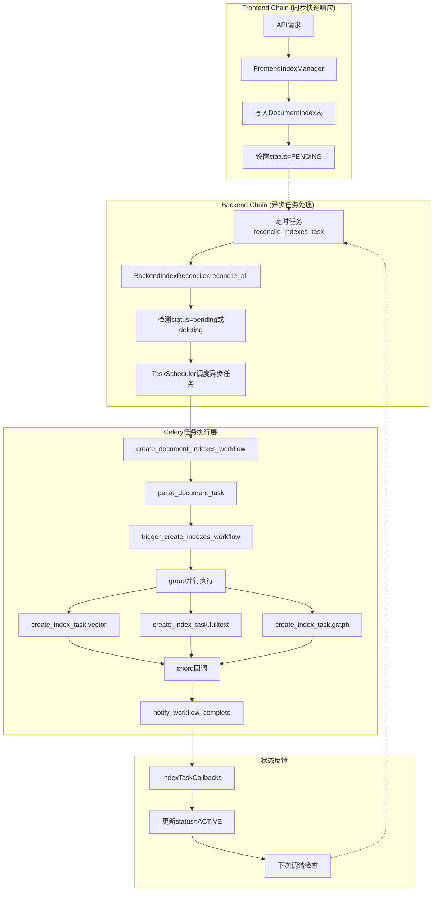

# ApeRAG 索引链路架构设计文档

## 概述

ApeRAG的索引链路架构采用双链路设计模式，将索引管理分为前端链路（Frontend Chain）和后端链路（Backend Chain），通过状态驱动的调谐机制实现文档索引的异步处理。前端链路负责快速响应用户操作并设置索引期望状态，后端链路通过定时调谐器检测状态差异并调度异步任务执行实际的索引操作。

## 架构概览



## 核心设计思路

### 1. 双链路分离

**前端链路（Frontend Chain）**：
- 目标：快速响应用户操作，不阻塞API请求
- 实现：只操作数据库表，设置期望状态，立即返回
- 代码：`aperag/index/manager.py` 中的 `FrontendIndexManager`

**后端链路（Backend Chain）**：
- 目标：异步执行耗时的索引操作，支持重试和错误恢复
- 实现：通过定时任务持续扫描状态差异，调度异步任务
- 代码：`aperag/index/reconciler.py` 中的 `BackendIndexReconciler`

### 2. 状态驱动调谐

通过数据库表`DocumentIndex`记录每个文档索引的生命周期状态：

```python
class DocumentIndexStatus(str, Enum):
    PENDING = "pending"                    # 等待处理（创建或更新）
    CREATING = "creating"                  # 索引创建/更新任务正在进行
    ACTIVE = "active"                      # 索引处于最新状态，可用
    DELETING = "deleting"                  # 已请求删除
    DELETION_IN_PROGRESS = "deletion_in_progress"  # 索引删除任务正在进行
    FAILED = "failed"                      # 上次操作失败

class DocumentIndex(BaseModel):
    document_id: str
    index_type: DocumentIndexType     # vector/fulltext/graph
    status: DocumentIndexStatus       # 索引生命周期状态
    version: int                      # 版本号，递增触发重建
    observed_version: int             # 最后处理的版本号
```

**状态流转图:**
```
[不存在] → PENDING → CREATING → ACTIVE
              ↑           ↓
          PENDING ← FAILED

ACTIVE → DELETING → DELETION_IN_PROGRESS → [硬删除]
   ↓              ↓
DELETING ← FAILED
```

调谐器定时扫描所有记录，当索引处于`pending`或`deleting`状态且版本不匹配时触发相应操作。

### 3. TaskScheduler抽象层设计

**设计优势**：
- **业务逻辑与任务系统解耦**：Reconciler只关心"需要执行什么操作"，不关心"用什么系统执行"
- **多调度器支持**：可以在Celery、本地同步、Prefect/Airflow等工作流引擎之间切换
- **测试友好**：测试时可以使用LocalTaskScheduler同步执行，便于调试

```python
# 抽象接口
class TaskScheduler(ABC):
    def schedule_create_index(self, document_id: str, index_types: List[str]) -> str
    def schedule_update_index(self, document_id: str, index_types: List[str]) -> str  
    def schedule_delete_index(self, document_id: str, index_types: List[str]) -> str

# Reconciler使用抽象接口
class BackendIndexReconciler:
    def __init__(self, scheduler_type: str = "celery"):
        self.task_scheduler = create_task_scheduler(scheduler_type)
    
    def _reconcile_document_operations(self, document_id: str, operations: dict):
        if create_index_types:
            # 只调用抽象接口，不关心具体实现
            self.task_scheduler.schedule_create_index(document_id, create_index_types)
```

**Celery任务入口与业务代码分离**：
- Celery任务函数（`config/celery_tasks.py`）：负责任务调度、参数序列化、错误重试
- 业务逻辑（`aperag/tasks/document.py`）：负责具体的索引创建逻辑
- 这种分离使得业务逻辑可以独立测试，也便于在不同任务系统间迁移

## 异步任务体系

### 当前异步任务列表

ApeRAG当前定义了以下异步任务，每个任务都有明确的职责分工：

| 任务名称 | 功能 | 重试次数 | 位置 |
|---------|------|---------|------|
| `parse_document_task` | 解析文档内容，提取文本和元数据 | 3次 | config/celery_tasks.py |
| `create_index_task` | 创建单个类型的索引（vector/fulltext/graph） | 3次 | config/celery_tasks.py |
| `update_index_task` | 更新单个类型的索引 | 3次 | config/celery_tasks.py |
| `delete_index_task` | 删除单个类型的索引 | 3次 | config/celery_tasks.py |
| `trigger_create_indexes_workflow` | 动态扇出创建索引任务 | 无重试 | config/celery_tasks.py |
| `trigger_update_indexes_workflow` | 动态扇出更新索引任务 | 无重试 | config/celery_tasks.py |
| `trigger_delete_indexes_workflow` | 动态扇出删除索引任务 | 无重试 | config/celery_tasks.py |
| `notify_workflow_complete` | 聚合工作流结果并通知完成 | 无重试 | config/celery_tasks.py |
| `reconcile_indexes_task` | 定时调谐器任务 | 无重试 | config/celery_tasks.py |

### 任务设计原则

1. **细粒度任务**：每个索引类型（vector/fulltext/graph）都是独立的任务，支持单独重试
2. **动态编排**：通过trigger任务在运行时决定要执行哪些索引任务
3. **分层重试**：业务任务支持重试，编排任务不重试
4. **状态回调**：每个任务完成后都会回调更新数据库状态

### 并发执行设计

#### Celery Group + Chord模式

使用Celery的`group`实现并行执行，`chord`实现结果聚合：

```python
# Group：并行执行多个索引任务
parallel_index_tasks = group([
    create_index_task.s(document_id, "vector", parsed_data_dict),
    create_index_task.s(document_id, "fulltext", parsed_data_dict),
    create_index_task.s(document_id, "graph", parsed_data_dict)
])

# Chord：等待所有并行任务完成后执行回调
workflow_chord = chord(
    parallel_index_tasks,
    notify_workflow_complete.s(document_id, "create", ["vector", "fulltext", "graph"])
)
```

#### 任务串联机制

通过Celery的`chain`实现任务串联，通过`signature`传递参数：

```python
# 串联执行：解析 -> 动态扇出
workflow_chain = chain(
    parse_document_task.s(document_id),  # 第一个任务
    trigger_create_indexes_workflow.s(document_id, index_types)  # 第二个任务，接收第一个任务的结果
)

# signature机制传递参数
# parse_document_task的返回值会作为trigger_create_indexes_workflow的第一个参数
```

#### 参数传递和数据流

```python
# 数据流：
# 1. parse_document_task 返回 ParsedDocumentData.to_dict()
# 2. trigger_create_indexes_workflow 接收解析结果
# 3. 动态创建并行任务，每个任务都收到完整的解析数据
# 4. notify_workflow_complete 聚合所有索引任务的结果

def trigger_create_indexes_workflow(self, parsed_data_dict: dict, document_id: str, index_types: List[str]):
    # parsed_data_dict是上一个任务的返回值
    parallel_index_tasks = group([
        # 每个并行任务都能访问完整的解析数据
        create_index_task.s(document_id, index_type, parsed_data_dict)
        for index_type in index_types
    ])
```

## 具体执行链路示例

### 创建索引执行链路

以用户上传文档触发索引创建为例：

```python
# 1. 前端链路（同步，毫秒级）
API调用 -> FrontendIndexManager.create_document_indexes()
    ↓
写入DocumentIndex表记录：
{
    document_id: "doc123",
    index_type: "vector", 
    status: "pending",
    version: 1,
    observed_version: 0
}
    ↓ 
API立即返回200

# 2. 后端链路（异步，分钟级）
定时任务reconcile_indexes_task(每30秒执行) 
    ↓
BackendIndexReconciler.reconcile_all()
    ↓
检测到status=pending, observed_version < version
    ↓
CeleryTaskScheduler.schedule_create_index(doc123, ["vector", "fulltext", "graph"])
    ↓
create_document_indexes_workflow.delay()

# 3. Celery任务执行（异步，分钟到小时级）
parse_document_task("doc123")
├── 下载文档文件到本地临时目录
├── 调用docparser解析文档内容  
├── 返回ParsedDocumentData.to_dict()
└── 更新status="creating"
    ↓
trigger_create_indexes_workflow(parsed_data, "doc123", ["vector", "fulltext", "graph"])
├── 创建group并行任务
└── 启动chord等待
    ↓
并行执行：
├── create_index_task("doc123", "vector", parsed_data)
│   ├── 调用vector_indexer.create_index()
│   ├── 生成embedding并存入向量数据库
│   └── 回调IndexTaskCallbacks.on_index_created()
├── create_index_task("doc123", "fulltext", parsed_data)  
│   ├── 调用fulltext_indexer.create_index()
│   ├── 建立全文搜索索引
│   └── 回调IndexTaskCallbacks.on_index_created()
└── create_index_task("doc123", "graph", parsed_data)
    ├── 调用graph_indexer.create_index()
    ├── 构建知识图谱
    └── 回调IndexTaskCallbacks.on_index_created()
    ↓
notify_workflow_complete([result1, result2, result3], "doc123", "create", ["vector", "fulltext", "graph"])
├── 聚合所有索引任务结果
├── 记录工作流完成日志
└── 返回WorkflowResult
```

### 更新索引执行链路

用户修改文档内容触发索引更新：

```python
# 1. 前端链路
API调用 -> FrontendIndexManager.update_document_indexes()
    ↓
所有现有索引记录version字段+1：
version: 1 -> 2 (触发重建)
    ↓
API立即返回

# 2. 后端链路
reconcile_indexes_task检测到version不匹配
    ↓
status=active但observed_version < version，判定为需要更新
    ↓
schedule_update_index() -> update_document_indexes_workflow()

# 3. 任务执行（与创建类似）
parse_document_task -> trigger_update_indexes_workflow -> 并行update_index_task
```

### 删除索引执行链路

用户删除文档触发索引删除：

```python
# 1. 前端链路  
API调用 -> FrontendIndexManager.delete_document_indexes()
    ↓
设置status="deleting"
    ↓
API立即返回

# 2. 后端链路
检测到status=deleting
    ↓
schedule_delete_index() -> delete_document_indexes_workflow()

# 3. 任务执行（无需解析）
trigger_delete_indexes_workflow -> 并行delete_index_task
├── 从向量数据库删除embeddings
├── 从全文搜索引擎删除文档
└── 从知识图谱删除节点和关系
```

## 异常处理机制

### 任务级别异常处理

每个Celery任务都配置了自动重试：

```python
@current_app.task(bind=True, autoretry_for=(Exception,), retry_kwargs={'max_retries': 3, 'countdown': 60})
def create_index_task(self, document_id: str, index_type: str, parsed_data_dict: dict):
    try:
        # 业务逻辑
        result = document_index_task.create_index(document_id, index_type, parsed_data)
        if result.success:
            self._handle_index_success(document_id, index_type, result.data)
        else:
            # 业务逻辑失败但不抛异常，避免无意义重试
            if self.request.retries >= self.max_retries:
                self._handle_index_failure(document_id, [index_type], result.error)
        return result.to_dict()
    except Exception as e:
        # 只有在重试次数用完后才标记失败
        if self.request.retries >= self.max_retries:
            self._handle_index_failure(document_id, [index_type], str(e))
        raise  # 继续抛出异常触发重试
```

### 工作流级别异常处理

通过`notify_workflow_complete`聚合错误：

```python
def notify_workflow_complete(self, index_results: List[dict], document_id: str, operation: str, index_types: List[str]):
    successful_tasks = []
    failed_tasks = []
    
    for result_dict in index_results:
        result = IndexTaskResult.from_dict(result_dict)
        if result.success:
            successful_tasks.append(result.index_type)
        else:
            failed_tasks.append(f"{result.index_type}: {result.error}")
    
    # 确定整体状态
    if not failed_tasks:
        status = TaskStatus.SUCCESS  # 全部成功
    elif successful_tasks:
        status = TaskStatus.PARTIAL_SUCCESS  # 部分成功
    else:
        status = TaskStatus.FAILED  # 全部失败
```

### 状态管理和错误恢复

通过数据库状态追踪错误：

```python
class IndexTaskCallbacks:
    @staticmethod
    def on_index_failed(document_id: str, index_type: str, error_message: str):
        """任务失败回调"""
        # 更新数据库状态
        doc_index.status = DocumentIndexStatus.FAILED
        doc_index.error_message = error_message
        
        # 下次reconcile时会重新尝试
```

### 错误恢复策略

1. **自动重试**：任务级别的3次自动重试，解决临时网络或资源问题
2. **状态重置**：用户可以手动重置失败状态，触发重新执行
3. **部分重试**：只重试失败的索引类型，不影响已成功的索引
4. **降级处理**：某些索引失败不影响文档的可搜索性（如graph索引失败但vector索引成功）

### 监控和告警

- **任务执行日志**：每个任务都记录详细的执行日志
- **失败率统计**：通过Celery监控工具查看任务失败率  
- **状态不一致检测**：定期检查长时间处于CREATING状态的任务
- **资源使用监控**：监控任务执行时的内存和CPU使用情况

## 代码组织结构

### 目录结构说明

```
aperag/
├── index/                    # 索引管理核心模块
│   ├── manager.py           # 前端索引管理器
│   ├── reconciler.py        # 后端调谐器
│   ├── base.py             # 索引器基类定义
│   ├── vector_index.py     # 向量索引实现
│   ├── fulltext_index.py   # 全文索引实现
│   └── graph_index.py      # 图索引实现
├── tasks/                   # 任务相关模块
│   ├── models.py           # 任务数据结构定义
│   ├── scheduler.py        # 任务调度器抽象层
│   ├── document.py         # 文档处理业务逻辑
│   └── utils.py            # 任务工具函数
└── db/
    └── models.py           # 数据库模型定义

config/
└── celery_tasks.py         # Celery任务定义
```

### 核心接口设计

#### 前端管理接口
```python
# aperag/index/manager.py
class FrontendIndexManager:
    async def create_document_indexes(self, session, document_id, user, index_types)
    async def update_document_indexes(self, session, document_id) 
    async def delete_document_indexes(self, session, document_id, index_types)
    async def get_document_index_status(self, session, document_id)
```

#### 调谐器接口
```python
# aperag/index/reconciler.py
class BackendIndexReconciler:
    def reconcile_all(self)  # 主调谐循环
    def _get_indexes_needing_reconciliation(self, session)  # 获取需要调谐的索引
    def _reconcile_grouped(self, indexes_needing_reconciliation)  # 批量处理调谐
```

#### 索引器接口
```python
# aperag/index/base.py
class BaseIndexer(ABC):
    def create_index(self, document_id, content, doc_parts, collection, **kwargs)
    def update_index(self, document_id, content, doc_parts, collection, **kwargs)
    def delete_index(self, document_id, collection, **kwargs)
    def is_enabled(self, collection)
```

### 数据流设计

#### 任务数据结构
```python
# aperag/tasks/models.py
@dataclass
class ParsedDocumentData:
    """文档解析结果，承载所有索引任务所需的数据"""
    document_id: str
    collection_id: str
    content: str              # 解析后的文本内容
    doc_parts: List[Any]      # 分块后的文档片段
    file_path: str           # 本地文件路径
    local_doc_info: LocalDocumentInfo  # 临时文件信息

@dataclass 
class IndexTaskResult:
    """单个索引任务的执行结果"""
    status: TaskStatus
    index_type: str
    document_id: str
    success: bool
    data: Optional[Dict[str, Any]]    # 索引元数据（如向量数量等）
    error: Optional[str]

@dataclass
class WorkflowResult:
    """整个工作流的执行结果"""
    workflow_id: str
    document_id: str
    operation: str            # create/update/delete
    status: TaskStatus
    successful_indexes: List[str]
    failed_indexes: List[str]
    index_results: List[IndexTaskResult]
```

## 总结

ApeRAG的索引链路架构通过以下技术设计实现了高效的文档索引处理：

### 核心优势

1. **响应速度快**：前端链路只操作数据库，API响应时间控制在毫秒级
2. **处理能力强**：后端异步处理支持大批量文档索引，通过并行任务提升吞吐量
3. **错误恢复好**：多层次的重试机制和状态管理，支持部分失败场景的优雅处理
4. **系统解耦强**：TaskScheduler抽象层使得业务逻辑与具体任务系统解耦
5. **监控完善**：全链路的状态追踪和日志记录，便于问题排查和性能优化

### 技术特点

1. **状态驱动**：通过期望状态和实际状态的差异检测，实现最终一致性
2. **动态编排**：运行时根据文档解析结果动态创建索引任务，避免静态工作流的局限性
3. **批量优化**：同一文档的多个索引任务共享解析结果，减少重复计算
4. **分层设计**：任务调度、业务逻辑、索引实现分层解耦，便于测试和维护

这个架构在保证系统可靠性的同时，为高并发的文档索引场景提供了良好的性能和扩展性支持。 