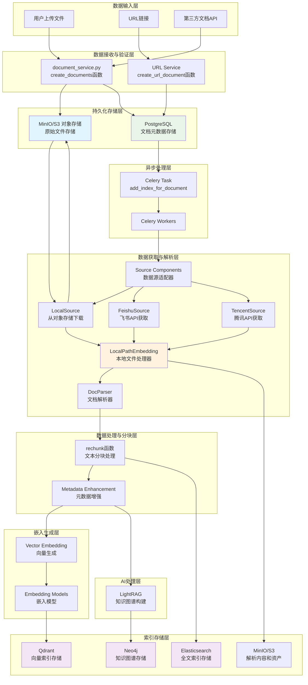

# ApeRAG 数据流转与处理架构

## 概述

本文档从**数据流转**的角度详细描述 ApeRAG 系统中各类数据（原始文档、解析内容、向量嵌入、全文索引、知识图谱）如何在不同组件间流转和处理。重点说明每个组件对数据做了什么具体操作，以及数据的存储位置和传输路径。

## 数据类型与存储位置

### 核心数据类型
1. **原始文档数据**: 用户上传的文件（PDF、Word、HTML等）
2. **解析后的结构化数据**: 文本内容、标题层次、图片等资产
3. **文本块数据**: 经过分块处理的文本片段
4. **向量数据**: 文本块的嵌入向量表示
5. **全文索引数据**: 用于全文搜索的倒排索引
6. **知识图谱数据**: 实体、关系和子图结构

### 存储位置映射
```
原始文档 → MinIO/S3 对象存储
文档元数据 → PostgreSQL 数据库
解析后的内容和资产 → MinIO/S3 对象存储
向量数据 → Qdrant 向量数据库
全文索引 → Elasticsearch
知识图谱 → Neo4j 图数据库
任务状态和缓存 → Redis
```

## 数据流转架构图



## 详细数据流转过程

### 阶段1: 数据接收与初始存储

#### 1.1 文件上传处理 (`document_service.py::create_documents`)
**输入数据**: 用户上传的原始文件流
**处理组件**: `aperag.service.document_service.create_documents`

**数据流转过程**:
```python
# 1. 接收文件数据
files: List[UploadedFile]  # 原始文件流

# 2. 验证和创建Document实例
document_instance = db_models.Document(
    user=user,
    name=item.name,
    status=db_models.Document.Status.PENDING,
    size=item.size,
    collection_id=collection.id,
)
await document_instance.asave()  # → PostgreSQL

# 3. 上传原始文件到对象存储
obj_store = get_object_store()  # MinIO/S3客户端
upload_path = f"{document_instance.object_store_base_path()}/original{file_suffix}"
await sync_to_async(obj_store.put)(upload_path, item)  # → MinIO/S3

# 4. 更新文档元数据
document_instance.object_path = upload_path
document_instance.metadata = json.dumps({"object_path": upload_path})
await document_instance.asave()  # → PostgreSQL
```

**数据存储结果**:
- 原始文件: `MinIO/S3: /{document_id}/original.{extension}`
- 文档元数据: `PostgreSQL: documents表`

#### 1.2 URL文档处理 (`document_service.py::create_url_document`)
**输入数据**: URL字符串
**处理组件**: `aperag.service.document_service.create_url_document`

**数据流转过程**:
```python
# 1. 创建文档记录(不立即下载内容)
document_instance = db_models.Document(
    user=user,
    name=url + ".html",
    status=db_models.Document.Status.PENDING,
    collection_id=collection.id,
    size=0,  # 初始大小为0
)
await document_instance.asave()  # → PostgreSQL

# 2. 保存URL元数据
document_instance.metadata = json.dumps({"url": json.dumps(url)})
await document_instance.asave()  # → PostgreSQL

# 3. 触发爬虫任务
crawl_domain.delay(url, url, collection_id, user, max_pages=2)  # → Celery队列
```

### 阶段2: 异步任务触发与文件获取

#### 2.1 索引任务启动 (`tasks/index.py::add_index_for_document`)
**输入数据**: `document_id`
**处理组件**: `aperag.tasks.index.add_index_for_document`

**数据流转过程**:
```python
# 1. 从数据库加载文档信息
document = Document.objects.get(id=document_id)  # ← PostgreSQL
metadata = json.loads(document.metadata)

# 2. 获取集合配置
collection = async_to_sync(document.get_collection)()  # ← PostgreSQL
config = parseCollectionConfig(collection.config)

# 3. 初始化Source组件
source = get_source(config)  # 根据配置获取对应的Source实现
```

#### 2.2 文件下载与本地化 (Source Components)
**输入数据**: 对象存储路径或第三方API参数
**处理组件**: `aperag.source.{local/feishu/tencent}.Source`

**LocalSource数据流转**:
```python
# LocalSource.prepare_document()
# 1. 从对象存储下载文件
obj_store = get_object_store()
file_content = obj_store.get(document.object_path)  # ← MinIO/S3

# 2. 创建本地临时文件
local_temp_path = f"/tmp/aperag_{document_id}_{timestamp}"
with open(local_temp_path, 'wb') as f:
    f.write(file_content)  # → 本地临时文件

# 3. 返回本地文件描述
return LocalDoc(path=local_temp_path, metadata=metadata)
```

**FeishuSource数据流转**:
```python
# FeishuSource.prepare_document()
# 1. 调用飞书API获取文档内容
feishu_client = FeishuClient(app_id, app_secret)
doc_content = feishu_client.get_document(doc_id)  # ← 飞书API

# 2. 转换为本地文件
local_temp_path = f"/tmp/feishu_{doc_id}.html"
with open(local_temp_path, 'w') as f:
    f.write(doc_content)  # → 本地临时文件

return LocalDoc(path=local_temp_path, metadata=metadata)
```

### 阶段3: 文档解析与结构化处理

#### 3.1 文档解析 (`llm/embed/base_embedding.py::LocalPathEmbedding`)
**输入数据**: 本地文件路径
**处理组件**: `aperag.llm.embed.base_embedding.LocalPathEmbedding`

**数据流转过程**:
```python
# LocalPathEmbedding.parse_doc()
# 1. 文件格式检测和解析
parser = DocParser()
filepath = Path(self.filepath)  # ← 本地临时文件
parts = parser.parse_file(filepath, self.file_metadata)  # → List[Part]

# 返回的parts包含:
# - MarkdownPart: 主要文本内容
# - AssetBinPart: 图片、附件等二进制资产
# - TextPart: 纯文本片段
```

**DocParser解析结果**:
```python
# 对于PDF文件
parts = [
    MarkdownPart(markdown="# 标题\n内容...", metadata={"source": "page_1"}),
    AssetBinPart(data=b"image_binary_data", asset_id="img_001"),
    TextPart(content="表格数据", metadata={"type": "table"})
]
```

#### 3.2 内容分块 (`docparser/chunking.py::rechunk`)
**输入数据**: 解析后的文档部分列表
**处理组件**: `aperag.docparser.chunking.rechunk`

**数据流转过程**:
```python
# rechunk函数处理
original_parts = [MarkdownPart, AssetBinPart, ...]  # ← DocParser输出
chunked_parts = rechunk(
    original_parts, 
    chunk_size=self.chunk_size,      # 例如: 1000
    chunk_overlap=self.chunk_overlap, # 例如: 200
    tokenizer=self.tokenizer
)  # → List[TextPart]

# 分块结果示例
chunked_parts = [
    TextPart(content="第一段文本...", metadata={"chunk_id": 0, "titles": ["章节1"]}),
    TextPart(content="第二段文本...", metadata={"chunk_id": 1, "titles": ["章节1", "小节1.1"]}),
    # ...
]
```

#### 3.3 元数据增强与节点创建
**输入数据**: 分块后的文本部分
**处理组件**: `LocalPathEmbedding.load_data`

**数据流转过程**:
```python
# 1. 为每个文本块添加上下文信息
for part in chunked_parts:
    paddings = []
    
    # 添加标题层次
    if "titles" in part.metadata:
        paddings.append("Breadcrumbs: " + " > ".join(part.metadata["titles"]))
    
    # 添加用户标签
    if "labels" in part.metadata:
        labels = [f"{item['key']}={item['value']}" for item in part.metadata.get("labels", [])]
        paddings.append(" ".join(labels))
    
    # 构建最终文本
    prefix = "\n\n".join(paddings) if paddings else ""
    final_text = f"{prefix}\n\n{part.content}" if prefix else part.content
    
    # 创建LlamaIndex节点
    node = TextNode(text=final_text, metadata=part.metadata)
    nodes.append(node)  # → List[TextNode]
```

### 阶段4: 多模态索引生成与存储

#### 4.1 向量嵌入生成与存储
**输入数据**: TextNode列表
**处理组件**: 嵌入模型 + Qdrant连接器

**数据流转过程**:
```python
# 1. 提取文本内容
texts = [node.get_content() for node in nodes]  # → List[str]

# 2. 生成向量嵌入
vectors = self.embedding.embed_documents(texts)  # → List[List[float]]
# embedding可能是OpenAI API或本地模型，生成1536维向量

# 3. 将向量添加到节点
for i, vector in enumerate(vectors):
    nodes[i].embedding = vector  # → TextNode with embedding

# 4. 存储到Qdrant向量数据库
vector_ids = self.connector.store.add(nodes)  # → Qdrant
# 返回向量ID列表: ["vec_001", "vec_002", ...]

# 5. 更新文档关联ID
relate_ids = {"ctx": vector_ids}
document.relate_ids = json.dumps(relate_ids)  # → PostgreSQL
```

**Qdrant存储结构**:
```json
{
  "id": "vec_001",
  "vector": [0.1, 0.2, ...],  // 1536维向量
  "payload": {
    "text": "增强后的文本内容",
    "metadata": {
      "source": "document_123",
      "chunk_id": 0,
      "titles": ["章节1"]
    }
  }
}
```

#### 4.2 全文索引创建
**输入数据**: 完整文档内容
**处理组件**: `aperag.context.full_text.insert_document`

**数据流转过程**:
```python
# 1. 获取完整文档内容
if md_part:  # 如果有Markdown部分
    content = md_part.markdown
else:  # 否则合并所有文本块
    content = "\n\n".join([part.content for part in chunked_parts])

# 2. 创建全文索引
index_name = generate_fulltext_index_name(collection.id)  # "collection_123_fulltext"
insert_document(
    index=index_name,           # → Elasticsearch索引名
    doc_id=document.id,         # → 文档ID
    title=document.name,        # → 文档标题
    content=content             # → 完整文本内容
)  # → Elasticsearch
```

**Elasticsearch存储结构**:
```json
{
  "doc_id": "document_123",
  "title": "示例文档.pdf",
  "content": "完整的文档文本内容...",
  "timestamp": "2024-01-01T00:00:00Z"
}
```

#### 4.3 解析内容与资产保存
**输入数据**: 解析后的内容和资产
**处理组件**: MinIO/S3对象存储

**数据流转过程**:
```python
if self.object_store_base_path:
    obj_store = get_object_store()
    base_path = self.object_store_base_path  # "document_123/"
    
    # 1. 保存Markdown内容
    md_upload_path = f"{base_path}/parsed.md"
    md_data = content.encode("utf-8")
    obj_store.put(md_upload_path, md_data)  # → MinIO/S3
    
    # 2. 保存资产文件
    for part in doc_parts:
        if isinstance(part, AssetBinPart):
            asset_upload_path = f"{base_path}/assets/{part.asset_id}"
            obj_store.put(asset_upload_path, part.data)  # → MinIO/S3
```

**对象存储最终结构**:
```
MinIO/S3:
  document_123/
    ├── original.pdf          # 原始文件
    ├── parsed.md            # 解析后的Markdown内容
    └── assets/
        ├── img_001.png      # 提取的图片
        └── table_001.csv    # 提取的表格
```

### 阶段5: 知识图谱构建（可选）

#### 5.1 LightRAG知识图谱处理
**输入数据**: 完整文档内容
**处理组件**: `aperag.tasks.index.add_lightrag_index_task`

**数据流转过程**:
```python
# 1. 异步LightRAG任务
async def _async_add_lightrag_index():
    # 获取LightRAG实例
    rag_holder = await lightrag_holder.get_lightrag_holder(collection)
    
    # 2. 插入文档到LightRAG
    await rag_holder.ainsert(
        input=content,           # ← 完整文档内容
        ids=document_id,         # ← 文档ID
        file_paths=file_path     # ← 文件路径
    )  # → Neo4j + 内部向量存储
    
    # 3. 验证处理结果
    processed_docs = await rag_holder.get_processed_docs()
    assert str(document_id) in processed_docs
```

**Neo4j存储结构**:
```cypher
// 实体节点
CREATE (e:Entity {
  id: "entity_001",
  name: "北京",
  type: "地点",
  description: "中国首都"
})

// 关系
CREATE (e1:Entity)-[:位于 {
  source_doc: "document_123",
  confidence: 0.95
}]->(e2:Entity)
```

### 阶段6: 状态更新与资源清理

#### 6.1 文档状态管理
**数据流转**: 各个索引状态 → PostgreSQL

```python
# 在各个处理阶段更新状态
document.vector_index_status = Document.IndexStatus.COMPLETE     # 向量索引完成
document.fulltext_index_status = Document.IndexStatus.COMPLETE   # 全文索引完成
document.graph_index_status = Document.IndexStatus.COMPLETE      # 图谱索引完成

# 计算最终状态
document.update_overall_status()  # 根据各索引状态计算总体状态
document.save()  # → PostgreSQL
```

#### 6.2 临时文件清理
```python
# Source组件清理
if local_doc and source:
    source.cleanup_document(local_doc.path)  # 删除本地临时文件
    # os.remove("/tmp/aperag_123_timestamp")
```

## 数据完整性与一致性保证

### 事务管理
- **PostgreSQL**: 文档元数据更新使用数据库事务
- **对象存储**: 文件上传后再更新数据库路径
- **向量数据库**: 存储失败时回滚文档状态

### 错误恢复
- **重试机制**: Celery任务失败自动重试
- **状态跟踪**: 每个索引独立状态管理
- **数据清理**: 失败时清理相关数据

### 数据同步
- **关联ID管理**: PostgreSQL中保存各存储系统的ID映射
- **级联删除**: 删除文档时清理所有相关数据
- **一致性检查**: 定期验证数据完整性

## 性能优化策略

### 数据传输优化
- **流式处理**: 大文件分块传输
- **压缩存储**: 文本内容压缩存储
- **连接池**: 数据库连接复用

### 计算资源优化
- **批量处理**: 多文档批量嵌入生成
- **缓存机制**: 嵌入模型和解析结果缓存
- **并行处理**: 多个Celery Worker并行处理

这种以数据为中心的架构设计确保了：
1. **数据流向清晰**: 每个组件的输入输出明确
2. **职责分离**: 各组件专注特定的数据处理任务
3. **可扩展性**: 易于添加新的数据源和存储后端
4. **可追溯性**: 完整的数据处理链路可追踪

## 已知架构问题与改进计划

### 当前架构限制

虽然当前的数据流转架构运行良好，但存在一个重要的设计问题：**`LocalPathEmbedding` 类承担了过多职责，且数据接口设计限制了其他索引类型的复用**。

#### 核心问题
`LocalPathEmbedding.load_data()` 方法集中了多个处理步骤：
```python
def load_data(self) -> Tuple[List[str], str]:
    # 1. 文档解析 (DocParser)
    # 2. 内容分块 (rechunk) 
    # 3. 元数据增强
    # 4. 向量嵌入生成
    # 5. 资产存储
    # 6. 向量数据库存储
    
    return vector_ids, content  # 仅返回向量ID和文本内容
```

**问题影响**：
- **数据丢失**: 全文索引和知识图谱无法获取结构化的解析结果、分块元数据、层次信息
- **重复处理**: 不同索引类型无法复用文档解析和分块结果
- **扩展困难**: 添加新索引类型需要重新设计数据流
- **职责混乱**: 单一类处理了解析、分块、嵌入、存储等多个关注点

#### 具体例子

**全文索引的局限**：
```python
# 当前：只能获取合并后的文本
content = "# 标题\n内容..."  # 扁平字符串

# 理想：应该获取结构化数据
chunks = [
    {
        "content": "段落内容",
        "metadata": {
            "section": "第一章", 
            "hierarchy": ["第一章", "第一节"],
            "labels": [{"key": "类型", "value": "技术文档"}]
        }
    }
]
```

**知识图谱的局限**：
```python
# 当前：只能获取扁平文本
add_lightrag_index_task.delay(content, document.id, local_doc.path)

# 理想：应该获取文档结构
structured_data = {
    "sections": [{"title": "章节", "content": "..."}],
    "entities": [...],
    "hierarchy": {...}
}
```

### 解决方案

我们已经制定了详细的重构计划来解决这些问题：

#### 📋 RFC 001: Document Processing Pipeline Refactor

**参考文档**: [`docs/rfc/001-document-processing-pipeline-refactor.md`](../rfc/001-document-processing-pipeline-refactor.md)

**核心改进**：
1. **分离关注点**: 将文档解析、内容处理、索引生成分离为独立阶段
2. **标准化数据模型**: 定义 `ParsedDocument`、`ProcessedDocumentBundle` 等标准接口
3. **模块化处理器**: 为每种索引类型创建专门的处理器
4. **管道式架构**: 支持并行处理和数据复用

**预期收益**：
- **避免重复处理**: 文档只需解析一次，所有索引类型共享结果
- **丰富元数据支持**: 全文索引和知识图谱可以访问完整的结构化数据
- **并行处理**: 多种索引可以同时生成，提高处理效率
- **易于扩展**: 添加新索引类型无需修改现有代码

**实施时间线**：
- **阶段1-2** (1-4周): 提取数据模型和文档解析器
- **阶段3-4** (5-8周): 重构内容处理和索引生成
- **阶段5-6** (9-12周): 创建统一协调器并清理旧代码

#### 迁移策略
重构将采用渐进式方法，确保：
- **向后兼容**: 现有API在迁移期间保持可用
- **无中断部署**: 生产环境可以平滑过渡
- **充分测试**: 每个阶段都有完整的测试覆盖

### 对开发者的影响

#### 当前阶段
开发者在使用当前架构时应注意：
- `LocalPathEmbedding` 主要为向量索引设计，其他索引类型功能有限
- 添加新索引类型时考虑数据复用的限制
- 文档处理的性能瓶颈可能来自重复解析

#### 重构后
重构完成后，开发者将获得：
- **更清晰的组件边界**: 每个组件职责明确
- **更丰富的数据接口**: 可以访问完整的文档结构和元数据
- **更好的扩展性**: 轻松添加自定义索引处理器
- **更高的性能**: 并行处理和数据复用减少计算开销

---

**相关文档**：
- RFC详细设计：[`docs/rfc/001-document-processing-pipeline-refactor.md`](../rfc/001-document-processing-pipeline-refactor.md)
- 当前实现：`aperag/embed/local_path_embedding.py`
- 索引任务：`aperag/tasks/index.py` 